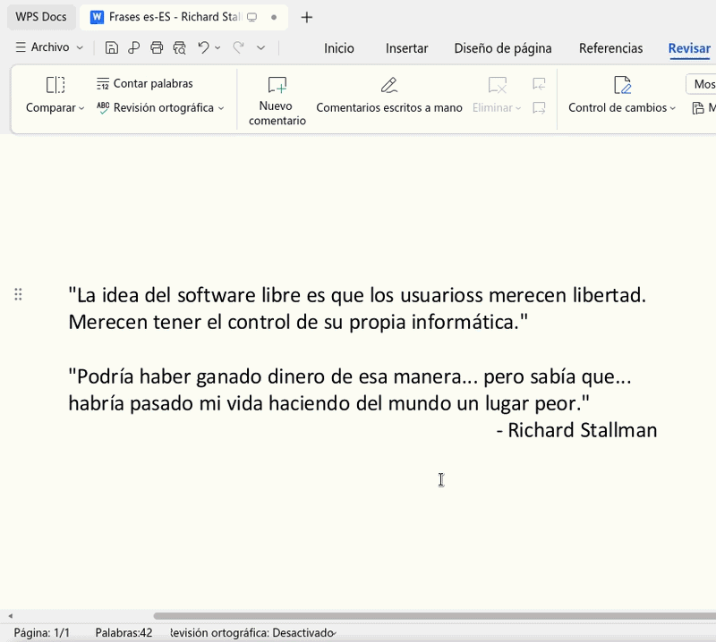

# WPS Office 12.x language packs for Linux

## Descarga WPS Office 12 Linux versión China

Descarga el instalador de WPS Office para tu distribución Linux basada en paquetería deb o RPM.

Sitio oficial de la página china:

- [https://www.wps.cn](https://www.wps.cn)

allí al dar clic, redirige a:

[https://www.wps.cn/product/wpslinux](https://www.wps.cn/product/wpslinux)

Luego instala el paquete.

### Instalar deb con un gestor de instalación de paquetes deb

Instalación con algún gestor de paquetes deb, en los Sistemas Operativos Linux debería estar instalado alguno, das clic derecho en el administrador de archivos e instalas con él:


### Instalar desde la terminal (Opcional)

Si usas Debian, Ubuntu, Linux Mint, etc, etc, si desea lo puede hacer también desde la terminal:

```bash
sudo dpkg -i wps-office*.deb
```

Si usas Fedora, Red Hat o similares:

```bash
sudo dnf install wps-office*.rpm
```

## Requisitos

Para continuar con este tutorial necesitas

- Tener **WPS Office 12.x** instalado en Linux según se describe arriba.
- Tener permisos de administrador con `sudo` o equivalente
- Haber abierto WPS Office al menos una vez (WPS Office crea su configuración de usuario después de abrirlo por primera vez. Si no existe este archivo `~/.config/Kingsoft/Office.conf` abre WPS Office, ciérralo y continúa con la instalación.)
- Tener este repositorio descargado o clonado en tu computadora.

## Instalar las interfaces de usuario multilenguaje MUI (Interfaz de usuario multilingüe)

Para instalar las MUI (Interfaz de usuario multilingüe), necesitas tener este proyecto en tu equipo. A continuación **dos** maneras de hacerlo, elija sólo **una** de ellas:

### Opción 1: descargar el ZIP e instalar las MUI

1. Abre esta página:

   [https://github.com/wachin/wps-office-12-language-packs](https://github.com/wachin/wps-office-12-language-packs)

2. Haz clic en el botón verde:

```
<> Code ▼
```

3. Haz clic en:

```
Download ZIP
```

4. Cuando termine la descarga, descomprime el archivo ZIP con clic derecho "Extraer aquí"
5. Abre una terminal allí y ejecuta:

```bash
sudo cp -r build/wps-mui/* /opt/kingsoft/wps-office/office6/mui/
```

con este comando quedarán instaladas las MUI (Interfaz de usuario multilingüe)

### Opción 2: clonar con Git e instalar las MUI

Si no tienes `git` instalado, instálalo:

```bash
sudo apt install git
```

Luego clona el repositorio:

```bash
git clone https://github.com/wachin/wps-office-12-language-packs
```

Entra a la carpeta:

```bash
cd wps-office-12-language-packs
```

ejecuta:

```bash
sudo cp -r build/wps-mui/* /opt/kingsoft/wps-office/office6/mui/
```

con este comando quedarán instaladas las MUI (Interfaz de usuario multilingüe)

## Verificar la instalación

Ese comando `sudo cp -r build/wps-mui/* /opt/kingsoft/wps-office/office6/mui/` copia las carpetas de idioma disponibles a la carpeta real de WPS Office en Linux en `/opt/kingsoft/wps-office/office6/mui/`.

En la versión China de WPS Office 12 que acabamos de instalar vienen instalados por defecto estos MUI (Interfaz de usuario multilenguaje):

/opt/kingsoft/wps-office/office6/mui/en_US
/opt/kingsoft/wps-office/office6/mui/ru_RU
/opt/kingsoft/wps-office/office6/mui/zh_CN

y además vienen por defecto estos dos diccionarios de corrección ortográfica:

/opt/kingsoft/wps-office/office6/dicts/spellcheck/en_CH
/opt/kingsoft/wps-office/office6/dicts/spellcheck/en_US

Desde tu administrador de archivos revisa esta ruta:

/opt/kingsoft/wps-office/office6/mui/

Deberías tener, además de los idiomas que trae de la versión China, lo siguiente:

```
de_DE
es_ES
es_MX
fr_CA
fr_FR
id_ID
ja_JP
pl_PL
pt_BR
pt_PT
th_TH
tr_TR
zh_HK
```

También se copia:

```
lang_list
```

Es una lista de selección. 


## Diccionarios disponibles y diccionarios probados

Este repositorio además prepara diccionarios Hunspell para que **WPS Office 12.x** pueda usarlos en Linux.

Por ahora hay que distinguir entre dos carpetas:

```
build/dicts-active/
wps-libreoffice-dicts-experimental/
```

La carpeta `build/dicts-active/` contiene los diccionarios seleccionados para instalar ahora. Son los que se están usando para las pruebas de WPS Office 12.

La carpeta `wps-libreoffice-dicts-experimental/` contiene todos los diccionarios convertidos desde LibreOffice. Se conserva en la raíz del repositorio como material experimental, porque en WPS Office 12 versión China no todas las variantes funcionan aunque tengan el formato correcto. Tal vez en una versión futura WPS vuelva a soportar todos esos diccionarios como ocurría en versiones antiguas de WPS Office para Linux.

Cada carpeta de diccionario tiene el formato que WPS espera:

```
dict.conf
main.aff
main.dic
```

Los archivos `main.aff` y `main.dic` vienen de la colección de diccionarios de LibreOffice. Los `dict.conf` se reutilizan desde los diccionarios antiguos de WPS Office cuando existen, y se generan para las variantes nuevas.

Los diccionarios activos actualmente son:

| Código  |     Diccionario     |
| ------- | ------------------- |
| `de_DE` | German (Germany)    |
| `es_ES` | Spanish (Spain)     |
| `fr_FR` | French (France)     |
| `id_ID` | Indonesian          |
| `pl_PL` | Polish              |
| `pt_BR` | Portuguese (Brazil) |
| `pt_PT` | Portuguese          |
| `ru_RU` | Russian (Russia)    |
| `tr_TR` | Turkish (Turkey)    |


## Instalar los diccionarios

Desde la raíz de este repositorio, ejecuta:

```bash
sudo cp -r build/dicts-active/* /opt/kingsoft/wps-office/office6/dicts/spellcheck/
```

Esto copia los diccionarios activos a la carpeta que WPS usa para la corrección ortográfica.

Después de copiar, la ruta de WPS debe quedar con carpetas como estas:

```
/opt/kingsoft/wps-office/office6/dicts/spellcheck/es_ES/
/opt/kingsoft/wps-office/office6/dicts/spellcheck/de_DE/
/opt/kingsoft/wps-office/office6/dicts/spellcheck/fr_FR/
/opt/kingsoft/wps-office/office6/dicts/spellcheck/pt_BR/
```

Y dentro de cada una:

```
dict.conf
main.aff
main.dic
```

## Activar un idioma de la interfaz en la configuración de WPS

Si eres un desarrollador edita el archivo de configuración con nano:

```bash
nano ~/.config/Kingsoft/Office.conf
```

Si eres un usuario normal usa Gedit u otro editor de texto. Para Gedit si no lo tienes instalado instálalo así:

```bash
sudo apt install gedit
```

y pon en la terminal:

```bash
gedit ~/.config/Kingsoft/Office.conf
```

Una vez abierto ese archivo selecciona todo el texto que haya allí con `Ctrl + A`, bórralo, y coloca en su lugar el contenido correspondiente al idioma que quieres usar.

La estructura siempre es la misma:

```
[General]
languages=CODIGO_DEL_IDIOMA

[6.0]
common\DefaultLanguage=NUMERO_IDIOMA
common\Local\UILanguage=NUMERO_IDIOMA
wpsoffice\Application%20Settings\AppComponentMode=prome_independ
wpsoffice\Application%20Settings\AppComponentModeInstall=prome_independ
```

Usa esta tabla para elegir el código y el número correcto:

|             Idioma               | `languages=` | `DefaultLanguage` y `UILanguage` |
| -------------------------------- | ------------ | -------------------------------- |
| English (United States)          | `en_US`      | `1033`                           |
| German (Germany)                 | `de_DE`      | `1031`                           |
| Spanish (Spain)                  | `es_ES`      | `3082`                           |
| Spanish (Mexico)                 | `es_MX`      | `2058`                           |
| French (Canada)                  | `fr_CA`      | `3084`                           |
| French (France)                  | `fr_FR`      | `1036`                           |
| Indonesian                       | `id_ID`      | `1057`                           |
| Japanese                         | `ja_JP`      | `1041`                           |
| Polish                           | `pl_PL`      | `1045`                           |
| Portuguese (Brazil)              | `pt_BR`      | `1046`                           |
| Portuguese (Portugal)            | `pt_PT`      | `2070`                           |
| Russian                          | `ru_RU`      | `1049`                           |
| Thai                             | `th_TH`      | `1054`                           |
| Turkish                          | `tr_TR`      | `1055`                           |
| Chinese (Simplified, China)      | `zh_CN`      | `2052`                           |
| Chinese (Traditional, Hong Kong) | `zh_HK`      | `3076`                           |

### Para inglés de Estados Unidos:

```
[General]
languages=en_US

[6.0]
common\DefaultLanguage=1033
common\Local\UILanguage=1033
wpsoffice\Application%20Settings\AppComponentMode=prome_independ
wpsoffice\Application%20Settings\AppComponentModeInstall=prome_independ
```

### Para el Español de España:

```
[General]
languages=es_ES

[6.0]
common\DefaultLanguage=3082
common\Local\UILanguage=3082
wpsoffice\Application%20Settings\AppComponentMode=prome_independ
wpsoffice\Application%20Settings\AppComponentModeInstall=prome_independ
```

### Para el Alemán de Alemania:

```
[General]
languages=de_DE

[6.0]
common\DefaultLanguage=1031
common\Local\UILanguage=1031
wpsoffice\Application%20Settings\AppComponentMode=prome_independ
wpsoffice\Application%20Settings\AppComponentModeInstall=prome_independ
```


### Para español de México:

```
[General]
languages=es_MX

[6.0]
common\DefaultLanguage=2058
common\Local\UILanguage=2058
wpsoffice\Application%20Settings\AppComponentMode=prome_independ
wpsoffice\Application%20Settings\AppComponentModeInstall=prome_independ
```

### Para francés de Canadá:

```
[General]
languages=fr_CA

[6.0]
common\DefaultLanguage=3084
common\Local\UILanguage=3084
wpsoffice\Application%20Settings\AppComponentMode=prome_independ
wpsoffice\Application%20Settings\AppComponentModeInstall=prome_independ
```

### Para francés de Francia:

```
[General]
languages=fr_FR

[6.0]
common\DefaultLanguage=1036
common\Local\UILanguage=1036
wpsoffice\Application%20Settings\AppComponentMode=prome_independ
wpsoffice\Application%20Settings\AppComponentModeInstall=prome_independ
```

### Para indonesio:

```
[General]
languages=id_ID

[6.0]
common\DefaultLanguage=1057
common\Local\UILanguage=1057
wpsoffice\Application%20Settings\AppComponentMode=prome_independ
wpsoffice\Application%20Settings\AppComponentModeInstall=prome_independ
```

### Para japonés:

```
[General]
languages=ja_JP

[6.0]
common\DefaultLanguage=1041
common\Local\UILanguage=1041
wpsoffice\Application%20Settings\AppComponentMode=prome_independ
wpsoffice\Application%20Settings\AppComponentModeInstall=prome_independ
```

### Para polaco:

```
[General]
languages=pl_PL

[6.0]
common\DefaultLanguage=1045
common\Local\UILanguage=1045
wpsoffice\Application%20Settings\AppComponentMode=prome_independ
wpsoffice\Application%20Settings\AppComponentModeInstall=prome_independ
```

### Para portugués de Brasil:

```
[General]
languages=pt_BR

[6.0]
common\DefaultLanguage=1046
common\Local\UILanguage=1046
wpsoffice\Application%20Settings\AppComponentMode=prome_independ
wpsoffice\Application%20Settings\AppComponentModeInstall=prome_independ
```

### Para portugués de Portugal:

```
[General]
languages=pt_PT

[6.0]
common\DefaultLanguage=2070
common\Local\UILanguage=2070
wpsoffice\Application%20Settings\AppComponentMode=prome_independ
wpsoffice\Application%20Settings\AppComponentModeInstall=prome_independ
```

### Para ruso:

```
[General]
languages=ru_RU

[6.0]
common\DefaultLanguage=1049
common\Local\UILanguage=1049
wpsoffice\Application%20Settings\AppComponentMode=prome_independ
wpsoffice\Application%20Settings\AppComponentModeInstall=prome_independ
```

### Para tailandés:

```
[General]
languages=th_TH

[6.0]
common\DefaultLanguage=1054
common\Local\UILanguage=1054
wpsoffice\Application%20Settings\AppComponentMode=prome_independ
wpsoffice\Application%20Settings\AppComponentModeInstall=prome_independ
```

### Para turco:

```
[General]
languages=tr_TR

[6.0]
common\DefaultLanguage=1055
common\Local\UILanguage=1055
wpsoffice\Application%20Settings\AppComponentMode=prome_independ
wpsoffice\Application%20Settings\AppComponentModeInstall=prome_independ
```

### Para chino simplificado de China:

```
[General]
languages=zh_CN

[6.0]
common\DefaultLanguage=2052
common\Local\UILanguage=2052
wpsoffice\Application%20Settings\AppComponentMode=prome_independ
wpsoffice\Application%20Settings\AppComponentModeInstall=prome_independ
```

### Para chino tradicional de Hong Kong:

```
[General]
languages=zh_HK

[6.0]
common\DefaultLanguage=3076
common\Local\UILanguage=3076
wpsoffice\Application%20Settings\AppComponentMode=prome_independ
wpsoffice\Application%20Settings\AppComponentModeInstall=prome_independ
```


Guarda el archivo, cierra WPS Office por completo y vuelve a abrirlo. Si el idioma quedó bien configurado, la interfaz abrirá en el idioma elegido.

## Solución para hacer funcionar los correctores ortográficos en WPS Office 12

En WPS Office 12 versión China no basta con copiar un diccionario a:

```
/opt/kingsoft/wps-office/office6/dicts/spellcheck/
```

También influye la configuración regional con la que entraste a la sesión de Linux desde el Login Manager, el idioma MUI instalado en WPS Office y el idioma configurado en:

```
~/.config/Kingsoft/Office.conf
```

Por eso algunos diccionarios aparecen en la ventana de `"Establecer idioma"`, pero no corrigen la ortografía. El caso más claro es español de México: el MUI `es_MX` y el diccionario `es_MX` pueden aparecer instalados, pero en las pruebas no funcionó la corrección ortográfica.

### Pruebas confirmadas

Estas son las pruebas realizadas hasta ahora:

|   Corrector    | Configuración regional elegida en el Login Manager | Locale  | MUI usado en WPS | Diccionario instalado |   Estado    |
| -------------- | -------------------------------------------------- | ------- | ---------------- | --------------------- | ----------- |
| Inglés         | `American English - Estados Unidos`                | `en_US` | `en_US`          | `en_US`               | Funciona    |
| Inglés         | `Inglés - Irlanda`                                 | `en_IE` | `en_US`          | `en_US`               | Funciona    |
| Inglés         | `British English - Reino Unido`                    | `en_GB` | `en_US`          | `en_US`               | Funciona    |
| Inglés         | `Inglés - Nueva Zelanda`                           | `en_NZ` | `en_US`          | `en_US`               | No funciona |
| Español        | `Español - Ecuador`                                | `es_EC` | `es_ES`          | `es_ES`               | Funciona    |
| Español        | `Español - Venezuela`                              | `es_VE` | `es_ES`          | `es_ES`               | Funciona    |
| Español        | `Mexican Spanish - México`                         | `es_MX` | `es_ES`          | `es_ES`               | Funciona    |
| Español        | `Español - Perú`                                   | `es_PE` | `es_ES`          | `es_ES`               | Funciona    |
| Español México | `Mexican Spanish - México`                         | `es_MX` | `es_MX`          | `es_MX`               | No funciona |
| Alemán         | `Alemán - Alemania`                                | `de_DE` | `de_DE`          | `de_DE`               | Funciona    |
| Francés        | `Francés - Francia`                                | `fr_FR` | `fr_FR`          | `fr_FR`               | Funciona    |

En MX Linux 23 el locale puede verse en el Login Manager: al seleccionar un idioma de la lista, el Login Manager muestra el código del locale. Por ejemplo, si eliges con clic:

```
Mexican Spanish - México
```

aparecerá:

```
es_MX
```

Si ya entraste a la sesión y quieres ver cuál locale está usando tu sistema, abre una terminal y ejecuta:

```bash
echo $LANG
```

Ejemplo:

```bash
$ echo $LANG
es_MX.UTF-8
```

### Configuraciones regionales de español que faltan por probar

Faltan por probar estas configuraciones regionales del Login Manager con el corrector español:

```
Español - Argentina
Español - Bolivia
Español - Colombia
European Spanish - España
Español - Nicaragua
Español - Panamá
Español - Estados Unidos
Español - Uruguay
```

### Lista de idiomas disponibles en el Login Manager de MX Linux 23

Esta es la lista observada en el Login Manager de MX Linux 23:

```
Árábe - Egipto
Bieloruso - Bielorrusia
Búlgaro - Bulgaria
Catalán - España
Checo - República Checa
Danés - Dinamarca
Austrian German - Austria
Swiss High German - Suiza
Alemán - Alemania
Greek - Grecia
Australian English - Australia
Canadian English - Canadá
British English - Reino Unido
Inglés - Irlanda
Inglés - Nueva Zelanda
American English - Estados Unidos
Español - Argentina
Español - Bolivia
Español - Colombia
Español - Ecuador
European Spanish - España
Mexican Spanish - México
Español - Nicaragua
Español - Panamá
Español - Perú
Español - Estados Unidos
Español - Uruguay
Español - Venezuela
Estonio - Estonia
Vasco - España
Persa - Iran
Finés - Finlandia
Francés - Bélgica
Canadian French - Canadá
Swiss French - Suiza
Francés - Francia
Irlandés - Irlanda
Hebreo - Israel
Croata - Croacia
Húngaro - Hungría
Islandés - Islandia
Italiano - Italia
Japonés - Japón
Georgiano-Georgia
Kazako - Kazajistán
Coreano - South Korea
Lituano - Lituania
Letón - Letonia
Macedonio - Macedonia
Norwegian Bokmål - Noruega
Flemish - Bélgica
Neerlandés (Holandés) - Países Bajos
Noruego Nynorsk - Noruega
Polaco - Polonia
Brazilian Portuguese - Brasil
European Portuguese - Portugal
Rumano - Rumanía
Ruso-Russia
Eslovaco - Eslovaquia
Esloveno - Eslovenia
Albanés - Albania
Serbio - Serbia
Sueco - Suecia
Turco - Turkey
Ukranio - Ucrania
Chino - China
Chino - Taiwán
```

### Cómo hacer funcionar el corrector ortográfico en inglés

Para que funcione el corrector ortográfico del idioma inglés, cierra sesión en MX Linux 23 y en el Login Manager elige:

```
American English - Estados Unidos
```

Después edita:

```bash
gedit ~/.config/Kingsoft/Office.conf
```

y deja este contenido:

```
[General]
languages=en_US

[6.0]
common\DefaultLanguage=1033
common\Local\UILanguage=1033
wpsoffice\Application%20Settings\AppComponentMode=prome_independ
wpsoffice\Application%20Settings\AppComponentModeInstall=prome_independ
```

WPS Office 12 ya trae por defecto el MUI:

```
/opt/kingsoft/wps-office/office6/mui/en_US
```

y el diccionario:

```
/opt/kingsoft/wps-office/office6/dicts/spellcheck/en_US/
```

Luego abre WPS Writer, entra en `"Review"` > `"Spell Check ⌵"` > `"Set language"`, selecciona `"English (United States)"` y pulsa `"Change Default"` si es necesario.

### Cómo hacer funcionar el corrector ortográfico en español

Para que funcione el corrector ortográfico del idioma español, cierra sesión en MX Linux 23 y en el Login Manager elige, por ejemplo:

```
Español - Ecuador
```

Después edita:

```bash
gedit ~/.config/Kingsoft/Office.conf
```

y deja este contenido para Español de España:

```
[General]
languages=es_ES

[6.0]
common\DefaultLanguage=3082
common\Local\UILanguage=3082
wpsoffice\Application%20Settings\AppComponentMode=prome_independ
wpsoffice\Application%20Settings\AppComponentModeInstall=prome_independ
```

En esta prueba deben estar instalados el MUI:

```
/opt/kingsoft/wps-office/office6/mui/es_ES
```

y el diccionario:

```
/opt/kingsoft/wps-office/office6/dicts/spellcheck/es_ES/
```

Luego abre WPS Writer, entra en `"Revisar"` > `"Revisión ortográfica ⌵"` > `"Establecer idioma"`, selecciona `"Español (España)"` y pulsa `"Establecer predeterminado"` si es necesario.

Por ahora, para español, el corrector confirmado es `es_ES`. No funcionaron como correctores activos estas variantes aunque existan como carpetas de diccionario convertidas:

```
es_AR
es_BO
es_CL
es_CO
es_CR
es_CU
es_DO
es_EC
es_GQ
es_GT
es_HN
es_MX
es_NI
es_PA
es_PE
es_PH
es_PR
es_PY
es_SV
es_US
es_UY
es_VE
```

### Prueba de español de México que no funcionó

Se probó entrar desde el Login Manager con:

```
Mexican Spanish - México
```

y configurar WPS con:

```
[General]
languages=es_MX

[6.0]
common\DefaultLanguage=2058
common\Local\UILanguage=2058
wpsoffice\Application%20Settings\AppComponentMode=prome_independ
wpsoffice\Application%20Settings\AppComponentModeInstall=prome_independ
```

Con el MUI:

```
/opt/kingsoft/wps-office/office6/mui/es_MX
```

y el diccionario:

```
/opt/kingsoft/wps-office/office6/dicts/spellcheck/es_MX/
```

WPS muestra `"Español (México)"` en la ventana de idioma, pero la corrección ortográfica no funciona.

### Cómo hacer funcionar el corrector ortográfico en alemán

Para alemán, cierra sesión y en el Login Manager elige:

```
Alemán - Alemania
```

Después configura `Office.conf` así:

```
[General]
languages=de_DE

[6.0]
common\DefaultLanguage=1031
common\Local\UILanguage=1031
wpsoffice\Application%20Settings\AppComponentMode=prome_independ
wpsoffice\Application%20Settings\AppComponentModeInstall=prome_independ
```

En esta prueba funcionó con:

```
/opt/kingsoft/wps-office/office6/mui/de_DE
/opt/kingsoft/wps-office/office6/dicts/spellcheck/de_DE/
```

### Cómo hacer funcionar el corrector ortográfico en francés

Para francés, cierra sesión y en el Login Manager elige:

```
Francés - Francia
```

Después configura `Office.conf` así:

```
[General]
languages=fr_FR

[6.0]
common\DefaultLanguage=1036
common\Local\UILanguage=1036
wpsoffice\Application%20Settings\AppComponentMode=prome_independ
wpsoffice\Application%20Settings\AppComponentModeInstall=prome_independ
```

En esta prueba funcionó con:

```
/opt/kingsoft/wps-office/office6/mui/fr_FR
/opt/kingsoft/wps-office/office6/dicts/spellcheck/fr_FR/
```

## Activar la corrección ortográfica

Después de instalar los diccionarios:

Abre WPS Writer. Ve en la cinta (o pestaña) a la que tiene el nombre:

`"Revisar"`

y allí en

`"Revisión ortográfica ⌵"`

darle clic a ese icono `"⌵"` y clic en el sub-menú:

`"Establecer idioma"`

y en la ventana que se abrirá por defecto estará entre los diccionarios disponibles `"Español (España)"`

y clic en `"Establecer predeterminado"` (aunque este ya estaba seleccionado por defecto por causa de que ya estaba instalado el MUI "es_ES")

Ahora, en la esquina inferior izquierda de la ventana observe la barra de estado, allí aparecerá un indicador similar a:

`Revisión ortográfica: Desactivado`

Haga clic sobre ese indicador y cambiará a `"Activado"`

Además si da clic al icono `"⌵"` estará ésta y otras opciones en un menú desplegable.

Una vez activada, WPS Office comenzará a revisar automáticamente la ortografía del documento. A partir de ese momento las palabras mal escritas aparecerán subrayadas, al hacer clic derecho sobre una palabra subrayada se mostrarán las sugerencias de corrección, el corrector permanecerá activo hasta que el usuario vuelva a deshabilitar esta opción:




## Si algo no funciona

Revisa estos puntos:

1. WPS Office fue abierto al menos una vez antes de editar `Office.conf`.
2. La carpeta `/opt/kingsoft/wps-office/office6/dicts/spellcheck/` existe.
3. Copiaste el contenido de `build/dicts-active`, no la carpeta contenedora completa.
4. Cada idioma instalado tiene `dict.conf`, `main.aff` y `main.dic`.
5. Cerraste y volviste a abrir WPS Office después de copiar los diccionarios.
6. El idioma elegido existe en la carpeta de diccionarios instalada.


## Referencia: idiomas descargados por WPS en Windows

En Windows, WPS Office descarga paquetes de idioma en rutas de usuario. Esta información sirve como referencia para investigar archivos de idioma de la interfaz.

Primero descarga e instala WPS Office 12 para Windows:

[https://wps.com/office/windows/](https://wps.com/office/windows/)

Ejemplo en Windows 10:


Luego descarga los idiomas:


Los idiomas descargados pueden aparecer en:

```
C:\Users\youruser\AppData\Roaming\kingsoft\wps_intl\addons\pool\win-x64
```


La lista de idiomas puede aparecer en:

```
C:\Users\youruser\AppData\Local\Kingsoft\WPS Office\12.1.0.25830\office6\mui\lang_list\lang_list.json
```


Algunos paquetes incluidos por la versión de Windows en español pueden aparecer en:

```
C:\Users\youruser\AppData\Local\Kingsoft\WPS Office\12.1.0.25830\office6\mui
```


Si este proyecto te ayudó, puedes dejar una estrella en el repositorio.
