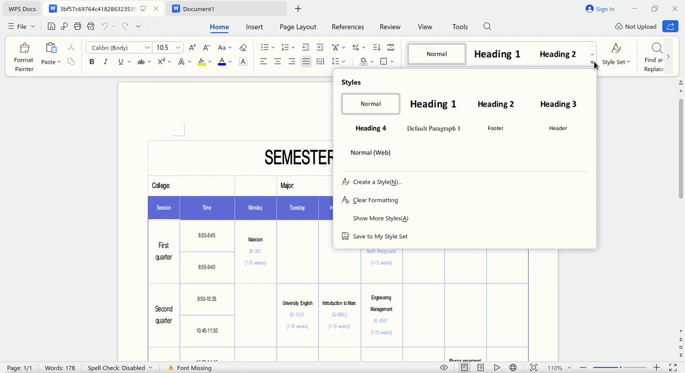

# WPS Office 12.x language packs for Linux

[](#download-wps-office-12-linux-chinese-version)
[](https://www.wps.cn/product/wpslinux)
[](https://github.com/wachin/wps-office-12-language-packs/releases)
[](#available-dictionaries-and-tested-dictionaries)
[](#quick-table-locale-mui-and-dictionary-with-the-same-code)
[](https://github.com/wachin/wps-office-12-language-packs/releases)
[](quick-guides/)



Available translations:

- [Español](README_ES.md), available for Spanish-language users.
- [Deutsch](README_DE.md), available for German-language users.
- [Français](README_FR.md), available for French-language users.
- [Bahasa Indonesia](README_ID.md), available for Indonesian-language users.
- [Português do Brasil](README_PT_BR.md), available for Brazilian Portuguese-language users.
- [Русский](README_RU.md), available for Russian-language users.
- [Türkçe](README_TR.md), available for Turkish-language users.


## Download WPS Office 12 Linux Chinese version

Download the WPS Office installer for your Linux distribution, either DEB-based or RPM-based.

Official Chinese website:

- [https://www.wps.cn](https://www.wps.cn)

clicking there redirects to:

[https://www.wps.cn/product/wpslinux](https://www.wps.cn/product/wpslinux)

Then install the package.

**Mirror download**
However, it may not have the latest versions, or it may take some time before they are uploaded there:

[https://mirrors.163.com/ubuntukylin/pool/partner/](https://mirrors.163.com/ubuntukylin/pool/partner/)

### Install the DEB package with a DEB package installer

Install it with a DEB package manager. On Linux systems, one should already be installed; right-click the file in your file manager and install it with that tool:


If not you can install some tool to install deb packages, like:

- gdebi

### Install from the terminal (Optional)

If you use Debian, Ubuntu, Linux Mint, and similar distributions, you can also do it from the terminal:

```bash
sudo dpkg -i wps-office*.deb
```

If you use Fedora, Red Hat, or similar distributions:

```bash
sudo dnf install wps-office*.rpm
```

## Requirements

To continue with this tutorial you need:

- Have **WPS Office 12.x** installed on Linux as described above.
- Have administrator permissions with `sudo` or an equivalent tool.
- Have opened WPS Office at least once. WPS Office creates its user configuration after it is opened for the first time. If `~/.config/Kingsoft/Office.conf` does not exist, open WPS Office, close it, and then continue with the installation.
- Have an internet connection to download the release files.

## Install the MUI multilingual user interfaces

Download the MUI pack. Go to the Release section:

[https://github.com/wachin/wps-office-12-language-packs/releases](https://github.com/wachin/wps-office-12-language-packs/releases)

download the file:

wps-office-12-mui.tar.xz


Extract it with right-click **in your preferred file manager**, then you will get the folder:

`wps-office-12-mui`

Then right-click on this folder and choose `Open terminal here` or something similar. (In modern Linux systems, right-clicking provides that option), then, from there

Install the MUI files with this command:

```bash
sudo cp -r ./* /opt/kingsoft/wps-office/office6/mui/
```

This command installs the MUI files (multilingual user interfaces).

## Verify the installation

That `sudo cp -r ./* /opt/kingsoft/wps-office/office6/mui/` command copies the available language folders to the real WPS Office folder on Linux: `/opt/kingsoft/wps-office/office6/mui/`.

The Chinese version of WPS Office 12 that we just installed includes these MUI folders by default:

```
/opt/kingsoft/wps-office/office6/mui/en_US
/opt/kingsoft/wps-office/office6/mui/ru_RU
/opt/kingsoft/wps-office/office6/mui/zh_CN
```

These are:

- `en_US` English (United States) Language
- `ru_RU` Russian (Russian Federation) Language
- `zh_CN` Chinese (China) Language

and it also includes these two spellcheck dictionaries by default:

```
/opt/kingsoft/wps-office/office6/dicts/spellcheck/en_CH
/opt/kingsoft/wps-office/office6/dicts/spellcheck/en_US
```

These are:

- `en_CH` Chinese & English(United States) Dictionary
- `en_US` English (United States) Dictionary

From your file manager, check this path:

/opt/kingsoft/wps-office/office6/mui/

In addition to the languages included in the Chinese version, you should have the following:

```
de_DE
es_ES
es_MX
fr_CA
fr_FR
id_ID
ja_JP
pl_PL
pt_BR
pt_PT
th_TH
tr_TR
zh_HK
```

This is also copied:

```
lang_list
```

It is a selection list.


## Available dictionaries and tested dictionaries

This repository also prepares Hunspell dictionaries so **WPS Office 12.x** can use them on Linux.

For now, two folders must be distinguished:

```
build/wps-office-12-dicts-active/
wps-libreoffice-dicts/
```

The `build/wps-office-12-dicts-active/` folder contains the dictionaries selected for installation now. These are the ones being used for WPS Office 12 testing.

The `wps-libreoffice-dicts/` folder contains all dictionaries converted from LibreOffice. It is kept in the repository root because, in WPS Office 12 Chinese version, not all variants work even when they have the correct format. Maybe in a future version WPS will support all those dictionaries again, as older WPS Office for Linux versions did.

Each dictionary folder has the format WPS expects:

```
dict.conf
main.aff
main.dic
```

The `main.aff` and `main.dic` files mainly come from the LibreOffice dictionary collection:

```
third-party/libreoffice-dictionaries-collection/dicts/
```

Source repository:

[https://github.com/wachin/libreoffice-dictionaries-collection](https://github.com/wachin/libreoffice-dictionaries-collection)

The `dict.conf` files are reused from old WPS Office dictionaries when they exist, and generated for the new variants.

Important exception: the active `pl_PL` dictionary comes from the old WPS Office 11.2.0.9255 dictionaries:

```
third-party/wps-office-11.2.0.9255-dicts/dicts/pl_PL/
```

Source repository:

[https://github.com/wachin/wps-office-11.2.0.9255-dicts](https://github.com/wachin/wps-office-11.2.0.9255-dicts)

That `pl_PL` is used because the Polish dictionary converted from LibreOffice did not work well in WPS Office 12. Its `main.aff` file contains:

```
SET ISO8859-2
```

By contrast, the old WPS Polish dictionary is in UTF-8 and its `main.aff` contains:

```
SET UTF-8
```

The currently active dictionaries are:

| Code    | Dictionary          |
| ------- | ------------------- |
| `de_DE` | German (Germany)    |
| `es_ES` | Spanish (Spain)     |
| `fr_FR` | French (France)     |
| `id_ID` | Indonesian          |
| `pl_PL` | Polish              |
| `pt_BR` | Portuguese (Brazil) |
| `pt_PT` | Portuguese          |
| `ru_RU` | Russian (Russia)    |
| `tr_TR` | Turkish (Turkey)    |

Note about `pt_PT`: on MX Linux 23 with locale `pt_PT.UTF-8`, MUI `pt_PT`, and the dictionary installed as `/opt/kingsoft/wps-office/office6/dicts/spellcheck/pt_PT/`, WPS Office 12 does not enable spellchecking for Portuguese from Portugal in the current tests. In the same installation, spellchecking does work using the `pt_BR` dictionary.


## Install the dictionaries

Go to the Release section:

[https://github.com/wachin/wps-office-12-language-packs/releases](https://github.com/wachin/wps-office-12-language-packs/releases)

download the file:

wps-office-12-dicts-active.tar.xz


Extract it with right-click in your preferred file manager, then you will get the folder:

`wps-office-12-dicts-active`

Then right-click on this folder and choose `Open terminal here` or something similar. (In modern Linux systems, right-clicking provides that option), then, from there

Install the dictionary files with this command:

```bash
sudo cp -r ./* /opt/kingsoft/wps-office/office6/dicts/spellcheck/
```

This copies the active dictionaries to the folder WPS uses for spellchecking.

After copying, the WPS path should contain folders like these:

```
/opt/kingsoft/wps-office/office6/dicts/spellcheck/es_ES/
/opt/kingsoft/wps-office/office6/dicts/spellcheck/de_DE/
/opt/kingsoft/wps-office/office6/dicts/spellcheck/fr_FR/
/opt/kingsoft/wps-office/office6/dicts/spellcheck/pt_BR/
```

And inside each one:

```
dict.conf
main.aff
main.dic
```

## Enable an interface language in the WPS configuration

If you are a developer, edit the configuration file with nano:

```bash
nano ~/.config/Kingsoft/Office.conf
```

If you are a regular user, use Gedit or another text editor. If you do not have Gedit installed, install it like this:

```bash
sudo apt install gedit
```

and enter this in the terminal:

```bash
gedit ~/.config/Kingsoft/Office.conf
```

Once that file is open, select all the text in it with `Ctrl + A`, delete it, and replace it with the content for the language you want to use.

The structure is always the same:

```
[General]
languages=LANGUAGE_CODE

[6.0]
common\DefaultLanguage=LANGUAGE_NUMBER
common\Local\UILanguage=LANGUAGE_NUMBER
wpsoffice\Application%20Settings\AppComponentMode=prome_independ
wpsoffice\Application%20Settings\AppComponentModeInstall=prome_independ
```

Use this table to choose the correct code and number:

| Language                         | `languages=` | `DefaultLanguage` and `UILanguage` |
| -------------------------------- | ------------ | ---------------------------------- |
| English (United States)          | `en_US`      | `1033`                             |
| German (Germany)                 | `de_DE`      | `1031`                             |
| Spanish (Spain)                  | `es_ES`      | `3082`                             |
| Spanish (Mexico)                 | `es_MX`      | `2058`                             |
| French (Canada)                  | `fr_CA`      | `3084`                             |
| French (France)                  | `fr_FR`      | `1036`                             |
| Indonesian                       | `id_ID`      | `1057`                             |
| Japanese                         | `ja_JP`      | `1041`                             |
| Polish                           | `pl_PL`      | `1045`                             |
| Portuguese (Brazil)              | `pt_BR`      | `1046`                             |
| Portuguese (Portugal)            | `pt_PT`      | `2070`                             |
| Russian                          | `ru_RU`      | `1049`                             |
| Thai                             | `th_TH`      | `1054`                             |
| Turkish                          | `tr_TR`      | `1055`                             |
| Chinese (Simplified, China)      | `zh_CN`      | `2052`                             |
| Chinese (Traditional, Hong Kong) | `zh_HK`      | `3076`                             |

### Quick table: locale, MUI, and dictionary with the same code

This table shows the languages where you can directly compare whether the `Locale`, the MUI, and the dictionary use the same code. The `x` means that no active dictionary with that same code is included. The `✅` symbol marks tested cases where that exact combination works.

| Language shown in the Login Manager | `Locale` | `MUI`   | `Dict`  | Tested  |
| ----------------------------------- | -------- | ------- | ------- | ------- |
| English (United States)             | `en_US`  | `en_US` | `en_US` | ✅       |
| German (Germany)                    | `de_DE`  | `de_DE` | `de_DE` | ✅       |
| Spanish (Spain)                     | `es_ES`  | `es_ES` | `es_ES` | ✅       |
| Spanish (Mexico)                    | `es_MX`  | `es_MX` | x       |         |
| French (Canada)                     | `fr_CA`  | `fr_CA` | x       |         |
| French (France)                     | `fr_FR`  | `fr_FR` | `fr_FR` | ✅       |
| Indonesian                          | `id_ID`  | `id_ID` | `id_ID` | ✅       |
| Japanese                            | `ja_JP`  | `ja_JP` | x       |         |
| Polish                              | `pl_PL`  | `pl_PL` | `pl_PL` | ✅       |
| Portuguese (Brazil)                 | `pt_BR`  | `pt_BR` | `pt_BR` | ✅       |
| Portuguese (Portugal)               | `pt_PT`  | `pt_PT` | `pt_PT` |         |
| Russian                             | `ru_RU`  | `ru_RU`* | `ru_RU` | ✅       |
| Thai                                | `th_TH`  | `th_TH` | x       |         |
| Turkish                             | `tr_TR`  | `tr_TR` | `tr_TR` | ✅       |
| Chinese (Simplified, China)         | `zh_CN`  | `zh_CN` | x       |         |
| Chinese (Traditional, Hong Kong)    | `zh_HK`  | `zh_HK` | x       |         |

* WPS Office 12 Chinese version already includes the `ru_RU` MUI by default, so the release MUI archive does not need to include that folder. The `ru_RU` spellcheck dictionary is still installed from the dictionaries archive.

### For English United States:

```
[General]
languages=en_US

[6.0]
common\DefaultLanguage=1033
common\Local\UILanguage=1033
wpsoffice\Application%20Settings\AppComponentMode=prome_independ
wpsoffice\Application%20Settings\AppComponentModeInstall=prome_independ
```

### For Spanish from Spain:

```
[General]
languages=es_ES

[6.0]
common\DefaultLanguage=3082
common\Local\UILanguage=3082
wpsoffice\Application%20Settings\AppComponentMode=prome_independ
wpsoffice\Application%20Settings\AppComponentModeInstall=prome_independ
```

### For German from Germany:

```
[General]
languages=de_DE

[6.0]
common\DefaultLanguage=1031
common\Local\UILanguage=1031
wpsoffice\Application%20Settings\AppComponentMode=prome_independ
wpsoffice\Application%20Settings\AppComponentModeInstall=prome_independ
```


### For Spanish from Mexico:

```
[General]
languages=es_MX

[6.0]
common\DefaultLanguage=2058
common\Local\UILanguage=2058
wpsoffice\Application%20Settings\AppComponentMode=prome_independ
wpsoffice\Application%20Settings\AppComponentModeInstall=prome_independ
```

### For French from Canada:

```
[General]
languages=fr_CA

[6.0]
common\DefaultLanguage=3084
common\Local\UILanguage=3084
wpsoffice\Application%20Settings\AppComponentMode=prome_independ
wpsoffice\Application%20Settings\AppComponentModeInstall=prome_independ
```

### For French from France:

```
[General]
languages=fr_FR

[6.0]
common\DefaultLanguage=1036
common\Local\UILanguage=1036
wpsoffice\Application%20Settings\AppComponentMode=prome_independ
wpsoffice\Application%20Settings\AppComponentModeInstall=prome_independ
```

### For Indonesian:

```
[General]
languages=id_ID

[6.0]
common\DefaultLanguage=1057
common\Local\UILanguage=1057
wpsoffice\Application%20Settings\AppComponentMode=prome_independ
wpsoffice\Application%20Settings\AppComponentModeInstall=prome_independ
```

### For Japanese:

```
[General]
languages=ja_JP

[6.0]
common\DefaultLanguage=1041
common\Local\UILanguage=1041
wpsoffice\Application%20Settings\AppComponentMode=prome_independ
wpsoffice\Application%20Settings\AppComponentModeInstall=prome_independ
```

### For Polish:

```
[General]
languages=pl_PL

[6.0]
common\DefaultLanguage=1045
common\Local\UILanguage=1045
wpsoffice\Application%20Settings\AppComponentMode=prome_independ
wpsoffice\Application%20Settings\AppComponentModeInstall=prome_independ
```

### For Brazilian Portuguese:

```
[General]
languages=pt_BR

[6.0]
common\DefaultLanguage=1046
common\Local\UILanguage=1046
wpsoffice\Application%20Settings\AppComponentMode=prome_independ
wpsoffice\Application%20Settings\AppComponentModeInstall=prome_independ
```

### For Portuguese from Portugal:

```
[General]
languages=pt_PT

[6.0]
common\DefaultLanguage=2070
common\Local\UILanguage=2070
wpsoffice\Application%20Settings\AppComponentMode=prome_independ
wpsoffice\Application%20Settings\AppComponentModeInstall=prome_independ
```

### For Russian:

```
[General]
languages=ru_RU

[6.0]
common\DefaultLanguage=1049
common\Local\UILanguage=1049
wpsoffice\Application%20Settings\AppComponentMode=prome_independ
wpsoffice\Application%20Settings\AppComponentModeInstall=prome_independ
```

### For Thai:

```
[General]
languages=th_TH

[6.0]
common\DefaultLanguage=1054
common\Local\UILanguage=1054
wpsoffice\Application%20Settings\AppComponentMode=prome_independ
wpsoffice\Application%20Settings\AppComponentModeInstall=prome_independ
```

### For Turkish:

```
[General]
languages=tr_TR

[6.0]
common\DefaultLanguage=1055
common\Local\UILanguage=1055
wpsoffice\Application%20Settings\AppComponentMode=prome_independ
wpsoffice\Application%20Settings\AppComponentModeInstall=prome_independ
```

### For Simplified Chinese from China:

```
[General]
languages=zh_CN

[6.0]
common\DefaultLanguage=2052
common\Local\UILanguage=2052
wpsoffice\Application%20Settings\AppComponentMode=prome_independ
wpsoffice\Application%20Settings\AppComponentModeInstall=prome_independ
```

### For Traditional Chinese from Hong Kong:

```
[General]
languages=zh_HK

[6.0]
common\DefaultLanguage=3076
common\Local\UILanguage=3076
wpsoffice\Application%20Settings\AppComponentMode=prome_independ
wpsoffice\Application%20Settings\AppComponentModeInstall=prome_independ
```


Save the file, close WPS Office completely, and open it again. If the language was configured correctly, the interface will open in the selected language.

## Solution to make spellcheckers work in WPS Office 12

In WPS Office 12 Chinese version, copying a dictionary to this folder is not enough:

```
/opt/kingsoft/wps-office/office6/dicts/spellcheck/
```

The regional setting you used when logging into the Linux session from the Login Manager, the MUI language installed in WPS Office, and the language configured in this file also matter:

```
~/.config/Kingsoft/Office.conf
```

That is why some dictionaries appear in the `"Set language"` window but do not perform spellchecking. The clearest case is Spanish from Mexico: the `es_MX` MUI and `es_MX` dictionary may appear installed, but in testing spellchecking only worked with the `es_ES` dictionary.

### Confirmed tests

These are the tests performed so far:

|  Spellchecker  | Regional setting chosen in the Login Manager | Locale  | MUI used in WPS | Installed dictionary |    Status     |
| -------------- | -------------------------------------------- | ------- | --------------- | -------------------- | ------------- |
| English        | `American English - United States`           | `en_US` | `en_US`         | `en_US` UTF-8        | Works         |
| English        | `English - Ireland`                          | `en_IE` | `en_US`         | `en_US` UTF-8        | Works         |
| English        | `Australian English - Australia`             | `en_AU` | `en_US`         | `en_US` UTF-8        | Works         |
| English        | `British English - United Kingdom`           | `en_GB` | `en_US`         | `en_US` UTF-8        | Works         |
| English        | `English - New Zealand`                      | `en_NZ` | `en_US`         | `en_US` UTF-8        | Does not work |
| Spanish        | `Spanish - Ecuador`                          | `es_EC` | `es_ES`         | `es_ES` UTF-8        | Works         |
| Spanish        | `European Spanish - Spain`                   | `es_ES` | `es_ES`         | `es_ES` UTF-8        | Works         |
| Spanish        | `Spanish - United States`                    | `es_US` | `es_ES`         | `es_ES` UTF-8        | Works         |
| Spanish        | `Spanish - Venezuela`                        | `es_VE` | `es_ES`         | `es_ES` UTF-8        | Works         |
| Spanish        | `Mexican Spanish - Mexico`                   | `es_MX` | `es_ES`         | `es_ES` UTF-8        | Works         |
| Spanish        | `Spanish - Peru`                             | `es_PE` | `es_ES`         | `es_ES` UTF-8        | Works         |
| Spanish        | `Spanish - Uruguay`                          | `es_UY` | `es_ES`         | `es_ES` UTF-8        | Works         |
| Spanish Mexico | `Mexican Spanish - Mexico`                   | `es_MX` | `es_MX`         | `es_MX` UTF-8        | Does not work |
| German         | `Austrian German - Austria`                  | `de_AT` | `de_DE`         | `de_DE` ISO8859-1    | Works         |
| German         | `German - Germany`                           | `de_DE` | `de_DE`         | `de_DE` ISO8859-1    | Works         |
| German         | `Swiss High German - Switzerland`            | `de_CH` | `de_DE`         | `de_DE` ISO8859-1    | Works         |
| French         | `French - France`                            | `fr_FR` | `fr_FR`         | `fr_FR` UTF-8        | Works         |
| French         | `Canadian French - Canada`                   | `fr_CA` | `fr_CA`         | `fr_FR` UTF-8        | Works         |
| Indonesian     | `Indonesian - Indonesia`                     | `id_ID` | `id_ID`         | `id_ID` ISO8859-1    | Works         |
| Polish         | `Polish - Poland`                            | `pl_PL` | `pl_PL`         | `pl_PL` UTF-8        | Works         |
| Portuguese BR  | `Brazilian Portuguese - Brazil`              | `pt_BR` | `pt_BR`         | `pt_BR` UTF-8        | Works         |
| Portuguese PT  | `European Portuguese - Portugal`             | `pt_PT` | `pt_PT`         | `pt_PT` UTF-8        | Does not work |
| Portuguese PT  | `European Portuguese - Portugal`             | `pt_PT` | `pt_PT`         | `pt_BR` UTF-8        | Works         |
| Russian        | `Russian - Russia`                           | `ru_RU` | `ru_RU`         | `ru_RU` UTF-8        | Works         |
| Turkish        | `Turkish - Turkey`                           | `tr_TR` | `tr_TR`         | `tr_TR` UTF-8        | Works         |

The encoding shown in the `Installed dictionary` column is taken from the `SET` line in each dictionary's `main.aff` file.

**Note about `pl_PL`**: after replacing the dictionary with the UTF-8 version taken from the old WPS Office 11.2.0.9255 dictionaries, it had to be selected manually in `"Review"` > `"Spell Check ⌵"` > `"Set language"` > `"Polski"`. After selecting it, spellchecking worked. The Polish dictionary converted from LibreOffice did not work well because it was in `ISO8859-2`, as seen in its `main.aff` file.

**Note about `pt_PT`**: with locale `pt_PT.UTF-8`, MUI `pt_PT`, and dictionary `pt_PT`, WPS Office 12 did not enable spellchecking. In that same configuration, it did work using the `pt_BR` dictionary.

**Note about `ru_RU`**: the spellchecker worked in a new document created from scratch. In a document originally created in English, even after pasting translated Russian text, WPS did not apply spellchecking correctly to the existing text.

On MX Linux 23, the locale can be seen in the Login Manager: when you select a language from the list, the Login Manager shows the locale code. For example, if you click:

```
Mexican Spanish - Mexico
```

this will appear:

```
es_MX
```

If you are already logged in and want to see which locale your system is using, open a terminal and run:

```bash
echo $LANG
```

Example:

```bash
$ echo $LANG
es_MX.UTF-8
```

### List of languages available in the MX Linux 23 Login Manager

This is the list observed in the MX Linux 23 Login Manager:


Available as a table with locales:

| Language in the Login Manager        | Locale  |
| ------------------------------------ | ------- |
| Arabic - Egypt                       | `ar_EG` |
| Belarusian - Belarus                 | `be_BY` |
| Bulgarian - Bulgaria                 | `bg_BG` |
| Catalan - Spain                      | `ca_ES` |
| Czech - Czech Republic               | `cs_CZ` |
| Danish - Denmark                     | `da_DK` |
| Austrian German - Austria            | `de_AT` |
| Swiss High German - Switzerland      | `de_CH` |
| German - Germany                     | `de_DE` |
| Greek - Greece                       | `el_GR` |
| Australian English - Australia       | `en_AU` |
| Canadian English - Canada            | `en_CA` |
| British English - United Kingdom     | `en_GB` |
| English - Ireland                    | `en_IE` |
| English - New Zealand                | `en_NZ` |
| American English - United States     | `en_US` |
| Spanish - Argentina                  | `es_AR` |
| Spanish - Bolivia                    | `es_BO` |
| Spanish - Colombia                   | `es_CO` |
| Spanish - Ecuador                    | `es_EC` |
| European Spanish - Spain             | `es_ES` |
| Mexican Spanish - Mexico             | `es_MX` |
| Spanish - Nicaragua                  | `es_NI` |
| Spanish - Panama                     | `es_PA` |
| Spanish - Peru                       | `es_PE` |
| Spanish - United States              | `es_US` |
| Spanish - Uruguay                    | `es_UY` |
| Spanish - Venezuela                  | `es_VE` |
| Estonian - Estonia                   | `et_EE` |
| Basque - Spain                       | `eu_ES` |
| Persian - Iran                       | `fa_IR` |
| Finnish - Finland                    | `fi_FI` |
| French - Belgium                     | `fr_BE` |
| Canadian French - Canada             | `fr_CA` |
| Swiss French - Switzerland           | `fr_CH` |
| French - France                      | `fr_FR` |
| Irish - Ireland                      | `ga_IE` |
| Hebrew - Israel                      | `he_IL` |
| Croatian - Croatia                   | `hr_HR` |
| Hungarian - Hungary                  | `hu_HU` |
| Icelandic - Iceland                  | `is_IS` |
| Italian - Italy                      | `it_IT` |
| Japanese - Japan                     | `ja_JP` |
| Georgian - Georgia                   | `ka_GE` |
| Kazakh - Kazakhstan                  | `kk_KZ` |
| Korean - South Korea                 | `ko_KR` |
| Lithuanian - Lithuania               | `lt_LT` |
| Latvian - Latvia                     | `lv_LV` |
| Macedonian - Macedonia               | `mk_MK` |
| Norwegian Bokmål - Norway            | `nb_NO` |
| Flemish - Belgium                    | `nl_BE` |
| Dutch - Netherlands                  | `nl_NL` |
| Norwegian Nynorsk - Norway           | `nn_NO` |
| Polish - Poland                      | `pl_PL` |
| Brazilian Portuguese - Brazil        | `pt_BR` |
| European Portuguese - Portugal       | `pt_PT` |
| Romanian - Romania                   | `ro_RO` |
| Russian - Russia                     | `ru_RU` |
| Slovak - Slovakia                    | `sk_SK` |
| Slovenian - Slovenia                 | `sl_SI` |
| Albanian - Albania                   | `sq_AL` |
| Serbian - Serbia                     | `sr_RS` |
| Swedish - Sweden                     | `sv_SE` |
| Turkish - Turkey                     | `tr_TR` |
| Ukrainian - Ukraine                  | `uk_UA` |
| Chinese - China                      | `zh_CN` |
| Chinese - Taiwan                     | `zh_TW` |


## How to make the English spellchecker work

To make the English spellchecker work, log out of MX Linux 23 and choose this in the Login Manager:

```
American English - United States
```

Then edit:

```bash
gedit ~/.config/Kingsoft/Office.conf
```

and leave this content:

```
[General]
languages=en_US

[6.0]
common\DefaultLanguage=1033
common\Local\UILanguage=1033
wpsoffice\Application%20Settings\AppComponentMode=prome_independ
wpsoffice\Application%20Settings\AppComponentModeInstall=prome_independ
```

WPS Office 12 already includes this MUI by default:

```
/opt/kingsoft/wps-office/office6/mui/en_US
```

and also the dictionary:

```
/opt/kingsoft/wps-office/office6/dicts/spellcheck/en_US/
```

### Enable English spellchecking

Now open WPS Writer. Go to the ribbon tab named:

`"Review"`

and there, in

`"Spell Check ⌵"`

click that `"⌵"` icon and click the submenu:

`"Set Spell Check language"`


in the window that opens, `"English (United States)"` will be among the available dictionaries by default.


if you want, you can click `"Change Default"` (although it was already selected by default because the `en_US` MUI was already installed).

Now, in the lower-left corner of the window, look at the status bar; an indicator similar to this will appear:

`Spell Check: Disabled ⌵`

Click that indicator and it will change to `"Enabled"`.

Also, if you click the `"⌵"` icon, this and other options will be available in a drop-down menu.

Once enabled, WPS Office will automatically start checking the document spelling. From that point on, misspelled words will be underlined; right-clicking an underlined word will show correction suggestions. The spellchecker will remain enabled until the user disables this option again:


---

## How to make the Spanish spellchecker work

To make the Spanish spellchecker work, log out of MX Linux 23 (if you are in another language) and choose, for example, this in the Login Manager:

```
Spanish - Ecuador
```

Then edit:

```bash
gedit ~/.config/Kingsoft/Office.conf
```

and leave this Spanish from Spain content:

```
[General]
languages=es_ES

[6.0]
common\DefaultLanguage=3082
common\Local\UILanguage=3082
wpsoffice\Application%20Settings\AppComponentMode=prome_independ
wpsoffice\Application%20Settings\AppComponentModeInstall=prome_independ
```

In this configuration, this MUI must be installed:

```
/opt/kingsoft/wps-office/office6/mui/es_ES
```

and the dictionary:

```
/opt/kingsoft/wps-office/office6/dicts/spellcheck/es_ES/
```


### Enable Spanish spellchecking

Open WPS Writer. Go to the ribbon tab named:

`"Revisar"`

and there, in

`"Revisión ortográfica ⌵"`

click that `"⌵"` icon and click the submenu:

`"Establecer idioma"`

and in the window that opens, `"Español (España)"` will be among the available dictionaries by default.

and click `"Establecer predeterminado"` (although it was already selected by default because the `es_ES` MUI was already installed).

Now, in the lower-left corner of the window, look at the status bar; an indicator similar to this will appear:

`Revisión ortográfica: Desactivado ⌵`

Click that indicator and it will change to `"Activado"`.


Also, if you click the `"⌵"` icon, this and other options will be available in a drop-down menu.

Once spellchecking is enabled, WPS Office will automatically start checking the document spelling. From that point on, misspelled words will be underlined; right-clicking an underlined word will show correction suggestions. The spellchecker will remain enabled until the user disables this option again:

For now, in this Chinese version of WPS Office 12, Spanish spellchecking only works with the `es_ES` dictionary from this repository:

/build/wps-office-12-dicts-active/es_ES/

However, the following dictionaries in the `wps-libreoffice-dicts` folder do not work as they did in WPS Office 11:

```
/wps-libreoffice-dicts/es_AR
/wps-libreoffice-dicts/es_BO
/wps-libreoffice-dicts/es_CL
/wps-libreoffice-dicts/es_CO
/wps-libreoffice-dicts/es_CR
/wps-libreoffice-dicts/es_CU
/wps-libreoffice-dicts/es_DO
/wps-libreoffice-dicts/es_EC
/wps-libreoffice-dicts/es_ES
/wps-libreoffice-dicts/es_GQ
/wps-libreoffice-dicts/es_GT
/wps-libreoffice-dicts/es_HN
/wps-libreoffice-dicts/es_MX
/wps-libreoffice-dicts/es_NI
/wps-libreoffice-dicts/es_PA
/wps-libreoffice-dicts/es_PE
/wps-libreoffice-dicts/es_PH
/wps-libreoffice-dicts/es_PR
/wps-libreoffice-dicts/es_PY
/wps-libreoffice-dicts/es_SV
/wps-libreoffice-dicts/es_US
/wps-libreoffice-dicts/es_UY
/wps-libreoffice-dicts/es_VE
```

### Spanish regional settings still to test

These Login Manager regional settings still need to be tested with the Spanish spellchecker:

```
Spanish - Argentina
Spanish - Bolivia
Spanish - Colombia
Spanish - Nicaragua
Spanish - Panama
```

The others that did work are listed above in the table.

## Test of the Spanish Mexico dictionary that did not work

I performed the following test because both the `es_MX` MUI and the `es_MX` spellcheck dictionary are available.

The test logged in from the Login Manager with:

```
Mexican Spanish - Mexico
```

and configured WPS with:

```
[General]
languages=es_MX

[6.0]
common\DefaultLanguage=2058
common\Local\UILanguage=2058
wpsoffice\Application%20Settings\AppComponentMode=prome_independ
wpsoffice\Application%20Settings\AppComponentModeInstall=prome_independ
```

With the MUI:

```
/opt/kingsoft/wps-office/office6/mui/es_MX
```

and the dictionary in:

```
/opt/kingsoft/wps-office/office6/dicts/spellcheck/es_MX/
```

WPS shows `"Español (México)"` in the language window, but spellchecking does not work. However, if the `"Español (España)"` dictionary is selected in that same window, it does work.

## How to make the German spellchecker work

For German, log out and choose this in the Login Manager:

```
German - Germany
```

Then configure `Office.conf` like this:

```
[General]
languages=de_DE

[6.0]
common\DefaultLanguage=1031
common\Local\UILanguage=1031
wpsoffice\Application%20Settings\AppComponentMode=prome_independ
wpsoffice\Application%20Settings\AppComponentModeInstall=prome_independ
```

Activation is similar to the English dictionary:


In this test, this worked:

```
/opt/kingsoft/wps-office/office6/mui/de_DE
/opt/kingsoft/wps-office/office6/dicts/spellcheck/de_DE/
```

## How to make the French spellchecker work

For French, log out and choose this in the Login Manager:

```
French - France
```

Activation is similar to the English dictionary.


Then configure `Office.conf` like this:

```
[General]
languages=fr_FR

[6.0]
common\DefaultLanguage=1036
common\Local\UILanguage=1036
wpsoffice\Application%20Settings\AppComponentMode=prome_independ
wpsoffice\Application%20Settings\AppComponentModeInstall=prome_independ
```

In this test, it worked with:

```
/opt/kingsoft/wps-office/office6/mui/fr_FR
/opt/kingsoft/wps-office/office6/dicts/spellcheck/fr_FR/
```


## How to make the Indonesian spellchecker work

For Indonesian, first generate the locale if it does not appear in the Login Manager yet:

```bash
sudo dpkg-reconfigure locales
```

In the list, mark:

```
id_ID.UTF-8 UTF-8
```

Then log out and choose this in the Login Manager:

```
Indonesian - Indonesia
```

Then configure `Office.conf` like this:

```
[General]
languages=id_ID

[6.0]
common\DefaultLanguage=1057
common\Local\UILanguage=1057
wpsoffice\Application%20Settings\AppComponentMode=prome_independ
wpsoffice\Application%20Settings\AppComponentModeInstall=prome_independ
```

Activation is similar to the English dictionary. `"Indonesian"` should appear in the spellcheck language window.


In this test, it worked with:

```
/opt/kingsoft/wps-office/office6/mui/id_ID
/opt/kingsoft/wps-office/office6/dicts/spellcheck/id_ID/
```

Note: although the Linux session uses `id_ID.UTF-8`, the installed `id_ID` dictionary uses `SET ISO8859-1` in `main.aff` and worked correctly in WPS Office 12.

## How to make the Polish spellchecker work

For Polish, log out and choose this in the Login Manager:

```
Polish - Poland
```

Then configure `Office.conf` like this:

```
[General]
languages=pl_PL

[6.0]
common\DefaultLanguage=1045
common\Local\UILanguage=1045
wpsoffice\Application%20Settings\AppComponentMode=prome_independ
wpsoffice\Application%20Settings\AppComponentModeInstall=prome_independ
```

Activation is similar to the English dictionary. `"Polski"` should appear in the spellcheck language window.


In this test, it worked with:

```
/opt/kingsoft/wps-office/office6/mui/pl_PL
/opt/kingsoft/wps-office/office6/dicts/spellcheck/pl_PL/
```

Note: for this test, the UTF-8 `pl_PL` dictionary taken from the old WPS Office 11.2.0.9255 dictionaries worked. The dictionary converted from LibreOffice was in `ISO8859-2` and did not work well in WPS Office 12.

## How to make the Brazilian Portuguese spellchecker work

For Brazilian Portuguese, log out and choose this in the Login Manager:

```
Brazilian Portuguese - Brazil
```

Then configure `Office.conf` like this:

```
[General]
languages=pt_BR

[6.0]
common\DefaultLanguage=1046
common\Local\UILanguage=1046
wpsoffice\Application%20Settings\AppComponentMode=prome_independ
wpsoffice\Application%20Settings\AppComponentModeInstall=prome_independ
```

Activation is similar to the English dictionary. `"Português do Brasil"` should appear in the spellcheck language window.


In this test, it worked with:

```
/opt/kingsoft/wps-office/office6/mui/pt_BR
/opt/kingsoft/wps-office/office6/dicts/spellcheck/pt_BR/
```

Note: although the `pt_BR` MUI contains `FallBack=pt_PT` in `lang.conf`, WPS spellchecked correctly when `"Português do Brasil"` was selected in the spellcheck language window. If `"Português (Portugal)"` is selected in that same session, the spellchecker does not work.

## Test of the Portuguese Portugal dictionary that did not work

I performed the following test because both the `pt_PT` MUI and the `pt_PT` spellcheck dictionary are available.

The test logged in from the Login Manager with:

```
European Portuguese - Portugal
```

and configured WPS with:

```
[General]
languages=pt_PT

[6.0]
common\DefaultLanguage=2070
common\Local\UILanguage=2070
wpsoffice\Application%20Settings\AppComponentMode=prome_independ
wpsoffice\Application%20Settings\AppComponentModeInstall=prome_independ
```

With the MUI:

```
/opt/kingsoft/wps-office/office6/mui/pt_PT
```

and the dictionary in:

```
/opt/kingsoft/wps-office/office6/dicts/spellcheck/pt_PT/
```

WPS showed `"Portuguê"` before the dictionary name was corrected, and now it should show `"Português (Portugal)"`; in both cases, spellchecking did not work with the `pt_PT` dictionary.

In that same `pt_PT.UTF-8` locale and `pt_PT` MUI configuration, spellchecking did work using the Brazilian Portuguese dictionary:

```
/opt/kingsoft/wps-office/office6/dicts/spellcheck/pt_BR/
```

## How to make the Russian spellchecker work

For Russian, log out and choose this in the Login Manager:

```
Russian - Russia
```

Then configure `Office.conf` like this:

```
[General]
languages=ru_RU

[6.0]
common\DefaultLanguage=1049
common\Local\UILanguage=1049
wpsoffice\Application%20Settings\AppComponentMode=prome_independ
wpsoffice\Application%20Settings\AppComponentModeInstall=prome_independ
```

Activation is similar to the English dictionary. `"Русский (Россия)"` should appear in the spellcheck language window.


In this test, it worked with:

```
/opt/kingsoft/wps-office/office6/mui/ru_RU
/opt/kingsoft/wps-office/office6/dicts/spellcheck/ru_RU/
```

Note: the Russian spellchecker worked correctly in a new document created from scratch. In a document originally created in English, even after pasting translated Russian text, WPS did not apply spellchecking correctly to the existing text.

## How to make the Turkish spellchecker work

For Turkish, log out and choose this in the Login Manager:

```
Turkish - Turkey
```

Then configure `Office.conf` like this:

```
[General]
languages=tr_TR

[6.0]
common\DefaultLanguage=1055
common\Local\UILanguage=1055
wpsoffice\Application%20Settings\AppComponentMode=prome_independ
wpsoffice\Application%20Settings\AppComponentModeInstall=prome_independ
```

Activation is similar to the English dictionary. `"Türkçe (Türkiye)"` should appear in the spellcheck language window.


In this test, it worked with:

```
/opt/kingsoft/wps-office/office6/mui/tr_TR
/opt/kingsoft/wps-office/office6/dicts/spellcheck/tr_TR/
```

## Reference: MUI packages downloaded by WPS on Windows

If you are curious and wonder where the MUI files for the graphical interface came from, I obtained them on Microsoft Windows 10. WPS Office downloads language packages into user paths; this information is useful as a reference for researching interface language files.

First download and install WPS Office 12 for Windows:

[https://wps.com/office/windows/](https://wps.com/office/windows/)

Example on Windows 10:


Then download the languages:


The downloaded languages may appear in:

```
C:\Users\youruser\AppData\Roaming\kingsoft\wps_intl\addons\pool\win-x64
```


The language list may appear in:

```
C:\Users\youruser\AppData\Local\Kingsoft\WPS Office\12.1.0.25830\office6\mui\lang_list\lang_list.json
```


Some packages included by the Spanish Windows version may appear in:

```
C:\Users\youruser\AppData\Local\Kingsoft\WPS Office\12.1.0.25830\office6\mui
```


If this project helped you, you can leave a star on the repository.

---

## Install Microsoft Windows fonts for document compatibility

Installing language packs and spellcheck dictionaries makes WPS Office 12 usable in many languages, but that is not enough when you open documents created in Microsoft Office. If the original fonts are not installed on your Linux system, layouts can shift, spacing can break, and WPS may substitute ugly fallback fonts. The document can look nothing like the original.

The fix is to install the same Windows fonts that were used to create the file. This also helps with LibreOffice, OnlyOffice, FreeOffice, Inkscape, GIMP, and other applications.

Original guide (Spanish, with screenshots):

- [Instalar fuentes tipográficas de Microsoft Windows en MX Linux, Mint, Ubuntu, Debian, etc.](https://facilitarelsoftwarelibre.blogspot.com/2018/11/instalar-fuentes-de-windows-en.html)

### Where to install fonts on Linux

Many old guides recommend copying fonts to `~/.fonts`. That still works, but Debian 13's Fontconfig marks `/etc/fonts/fonts.conf`  that path for future removal "<!-- the following element will be removed in the future --> <dir>~/.fonts</dir>". 

The recommended user location is:

```
~/.local/share/fonts
```

For system-wide installation (all users), use:

```
/usr/share/fonts/truetype/windows
```

But if it still works on your system:

`~/.fonts`

use it.

After copying fonts, restart WPS Office (and any other program that was already open) so it reloads the font list. In most cases Fontconfig detects new fonts automatically; run `fc-cache -fv` only if a program does not see them.

### Solution 1: Copy fonts from a Windows computer

This is the most complete method.

1. On a Windows PC, open `C:\Windows\Fonts`.
2. Select all font files with `Ctrl + A`, copy them, and paste them into a folder on a USB drive (for example `windows-fonts`).
3. On Linux, create the destination folder if it is not present, for example:

```bash
mkdir -p ~/.local/share/fonts
```

4. Linux recognize `.ttf` and `.otf`, copy `windows-fonts` into that folder, to keep them organized.
5. Close and reopen WPS Office.

**System-wide install:** copy the fonts to `/usr/share/fonts/truetype/windows-fonts` with administrator permissions. You can use a dual-pane file manager such as Krusader or Double Commander run as root. Be careful: do not delete or move unrelated system files, and do not open your personal documents from a root file manager so they don't accidentally gain root permissions.

### Solution 2: Download a Microsoft fonts collection from GitHub

If you do not have access to a Windows machine, you can download a font pack from the internet.

Original repository:

- [https://github.com/FSKiller/Microsoft-Fonts](https://github.com/FSKiller/Microsoft-Fonts)

which I forked, in which to add previews of the typefaces and the meanings of their font file names and some other indications:

- [https://github.com/wachin/Microsoft-Fonts](https://github.com/wachin/Microsoft-Fonts)

Quick install with Git:

```bash
mkdir -p ~/.local/share/fonts/Microsoft-Fonts
git clone https://github.com/wachin/Microsoft-Fonts
rm -rf Microsoft-Fonts/.git
mv Microsoft-Fonts/* ~/.local/share/fonts/Microsoft-Fonts/
rm -rf Microsoft-Fonts
```

### Solution 3: Download from w7df.com

Another download source is:

- [https://www.w7df.com/p/windows-10.html](https://www.w7df.com/p/windows-10.html)

Dwonload and extract the archive and place the content, for example in `~/.local/share/fonts`.

### Solution 4: Install core fonts with `ttf-mscorefonts-installer`

This package installs only a subset of Windows fonts, but it is easy to install on Debian, Ubuntu, Linux Mint, MX Linux, and similar distributions:

```bash
sudo apt-get install ttf-mscorefonts-installer
```

Fonts installed by this package include:

- Andale Mono
- Arial (Regular, Bold, Italic, Bold Italic)
- Arial Black
- Comic Sans MS (Bold)
- Courier New (Regular, Bold, Italic, Bold Italic)
- Georgia (Regular, Bold, Italic, Bold Italic)
- Impact
- Times New Roman (Regular, Bold, Italic, Bold Italic)
- Trebuchet (Regular, Bold, Italic, Bold Italic)
- Verdana (Regular, Bold, Italic, Bold Italic)
- Webdings

They are installed under:

```
/usr/share/fonts/truetype/msttcorefonts/
```

Package pages:

- [Ubuntu](https://packages.ubuntu.com/ttf-mscorefonts-installer)
- [Debian](https://packages.debian.org/ttf-mscorefonts-installer)

**Note:** if you already use PlayOnLinux or Wine, this package may already be installed.

# Best Font management on Linux with Fontmatrix or MainType

## FontMatrix

For me, the best font viewer for Linux is FontMatrix, but its maintenance has been abandoned. I am made a fork to try to revive it, you can follow the instructions to compile it in:

[https://github.com/wachin/fontmatrix](https://github.com/wachin/fontmatrix)

If font previews look too small, open **Edit > Preferences > Display > Default font size** and adjust the value (for example `10`), then restart Fontmatrix.

## MainType (with Wine)

Another great program is MainType that you can install with wine. I made a spanish tutorial in:

**Cómo instalar el administrador / visor de fuentes tipográficas gratuito MainType (de high-logic.com) en Linux, Ubuntu etc con Wine o PlayOnLinux**  
[https://facilitarelsoftwarelibre.blogspot.com/2023/09/instalar-el-administrador-de-fuentes-tipofraficas-maintype-en-wine-o-playonlinux.html](https://facilitarelsoftwarelibre.blogspot.com/2023/09/instalar-el-administrador-de-fuentes-tipofraficas-maintype-en-wine-o-playonlinux.html)  

# Tips when sharing documents

- When you share files with Windows users, prefer Windows fonts so the document opens the same way on both systems.
- Before sending a thesis, print job, or design file to another computer, confirm that the required fonts are installed there, or include the font files on a USB drive.
- After installing new fonts, close WPS Writer, WPS Presentation, and WPS Spreadsheets completely and open them again.

# Acknowledgments

To user [mmvill](https://github.com/mmvill), who wrote to me and told me that he found a way to make the Spanish spellcheck dictionary work in WPS Office 12.

### Additional references

- [Alternative to privative Microsoft Windows Fonts](https://github.com/wachin/Alternative-to-privative-Microsoft-Windows-Fonts)
- [Microsoft-Fonts (fork with documentation)](https://github.com/wachin/Microsoft-Fonts)
- [Linux Font Equivalents to Popular Web Typefaces](https://jonchristopher.us/blog/linux-font-equivalents-to-popular-web-typefaces/)
- [How do I install fonts? (Ubuntu documentation)](https://help.ubuntu.com/community/Fonts)
- [Font configuration (Arch Wiki)](https://wiki.archlinux.org/index.php/Font_configuration)
- [Microsoft fonts (Arch Wiki)](https://wiki.archlinux.org/index.php/Microsoft_fonts)
- [Install Free Office 2007 Fonts for Linux and XP - OpenOffice.org Ninja](https://www.oooninja.com/2008/01/calibri-linux-vista-fonts-download.html)
- [Metric Equivalent Fonts and Font Substitution - OpenOffice.org Ninja](https://www.oooninja.com/2008/02/metrical-equivalent-fonts-and-font.html)
- [Cómo instalar fuentes tipográficas en Linux](https://facilitarelsoftwarelibre.blogspot.com/2021/01/como-instalar-fuentes-tipograficas-en-linux.html)

---
