# Linux için WPS Office 12.x dil paketleri

Mevcut çeviriler:

- [İngilizce](README.md), İngilizce kullanıcıları için kullanılabilir.
- [Español](README_ES.md), İspanyolca kullanıcıları için kullanılabilir.
- [Deutsch](README_DE.md), Almanca kullanıcıları için kullanılabilir.
- [Français](README_FR.md), Fransızca kullanıcıları için kullanılabilir.
- [Bahasa Indonesia](README_ID.md), Endonezce kullanıcıları için kullanılabilir.
- [Português do Brasil](README_PT_BR.md), Brezilya Portekizcesi kullanıcıları için kullanılabilir.
- [Русский](README_RU.md), Rusça kullanıcıları için kullanılabilir.

Türkçe hızlı kılavuz: [quick-guides/README_TR.md](quick-guides/README_TR.md).

## WPS Office 12 Linux Çin sürümünü indirme

Linux dağıtımınız için WPS Office yükleyicisini indirin; DEB tabanlı veya RPM tabanlı olabilir.

Resmi Çin web sitesi:

- [https://www.wps.cn](https://www.wps.cn)

buraya tıklayınca şu adrese yönlendirilir:

[https://www.wps.cn/product/wpslinux](https://www.wps.cn/product/wpslinux)

Ardından paketi kurun.

**Yansı indirme (Mirror)**
Ancak en son sürümler orada bulunmayabilir veya oraya yüklenmeleri biraz zaman alabilir:

[https://mirrors.163.com/ubuntukylin/pool/partner/](https://mirrors.163.com/ubuntukylin/pool/partner/)

### DEB paketini bir DEB paket yükleyicisiyle kurma

Bir DEB paket yöneticisiyle kurun. Linux sistemlerinde bunlardan biri zaten kurulu olmalıdır; dosya yöneticinizde dosyaya sağ tıklayın ve bu araçla kuçalıştırın:

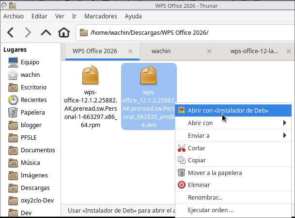

### Terminalden kurma (İsteğe bağlı)

Debian, Ubuntu, Linux Mint ve benzeri dağıtımlar kullanıyorsanız bunu terminalden de yapabilirsiniz:

```bash
sudo dpkg -i wps-office*.deb
```

Fedora, Red Hat veya benzeri dağıtımlar kullanıyorsanız:

```bash
sudo dnf install wps-office*.rpm
```

## Gereksinimler

Bu öğreticiye devam etmek için şunlara ihtiyacınız var:

- Yukarıda açıklandığı gibi Linux üzerinde **WPS Office 12.x** kurulu olmalı.
- `sudo` veya eşdeğer bir araçla yönetici izinlerine sahip olmalısınız.
- WPS Office en az bir kez açılmış olmalı. WPS Office, ilk kez açıldıktan sonra kullanıcı yapılandırmasını oluşturur. `~/.config/Kingsoft/Office.conf` yoksa WPS Office’i açın, kapatın ve kuruluma devam edin.
- Release dosyalarını indirmek için internet bağlantınız olmalı.

## MUI çok dilli kullanıcı arayüzlerini kurma

MUI paketini indirin. Releases bölümüne gidin:

[https://github.com/wachin/wps-office-12-language-packs/releases](https://github.com/wachin/wps-office-12-language-packs/releases)

şu dosyayı indirin:

wps-office-12-mui.tar.xz

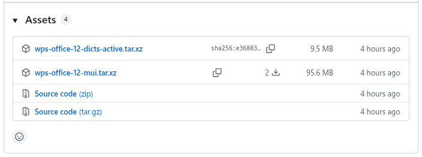

Tercih ettiğiniz dosya yöneticisinde **sağ tıklayarak** çıkarın. Ardından şu klasörü elde edeceksiniz:

`wps-office-12-mui`

Sonra bu klasöre sağ tıklayın ve `Open terminal here` ya da benzer bir seçeneği seçin. Modern Linux sistemlerinde sağ tıklama genellikle bu seçeneği sunar. Oradan,

MUI dosyalarını bu komutla kurun:

```bash
sudo cp -r ./* /opt/kingsoft/wps-office/office6/mui/
```

Bu komut MUI dosyalarını (çok dilli kullanıcı arayüzleri) kurar.

## Kurulumu doğrulama

`sudo cp -r ./* /opt/kingsoft/wps-office/office6/mui/` komutu, mevcut dil klasörlerini Linux’taki gerçek WPS Office klasörüne kopyalar: `/opt/kingsoft/wps-office/office6/mui/`.

Az önce kurduğumuz WPS Office 12 Çin sürümü varsayılan olarak şu MUI klasörlerini içerir:

```
/opt/kingsoft/wps-office/office6/mui/en_US
/opt/kingsoft/wps-office/office6/mui/ru_RU
/opt/kingsoft/wps-office/office6/mui/zh_CN
```

Bunlar:

- `en_US` İngilizce (Amerika Birleşik Devletleri) dili
- `ru_RU` Rusça (Rusya Federasyonu) dili
- `zh_CN` Çince (Çin) dili

ve ayrıca varsayılan olarak şu iki yazım denetimi sözlüğünü içerir:

```
/opt/kingsoft/wps-office/office6/dicts/spellcheck/en_CH
/opt/kingsoft/wps-office/office6/dicts/spellcheck/en_US
```

Bunlar:

- `en_CH` Çince ve İngilizce (Amerika Birleşik Devletleri) sözlüğü
- `en_US` İngilizce (Amerika Birleşik Devletleri) sözlüğü

Dosya yöneticinizden şu yolu kontrol edin:

/opt/kingsoft/wps-office/office6/mui/

Çin sürümünde bulunan dillere ek olarak şunlara sahip olmalısınız:

```
de_DE
es_ES
es_MX
fr_CA
fr_FR
id_ID
ja_JP
pl_PL
pt_BR
pt_PT
th_TH
tr_TR
zh_HK
```

Bu da kopyalanır:

```
lang_list
```

Bu bir seçim listesidir.


## Kullanılabilir sözlükler ve test edilmiş sözlükler

Bu depo ayrıca **WPS Office 12.x** Linux üzerinde kullanabilsin diye Hunspell sözlüklerini hazırlar.

Şimdilik iki klasörü ayırt etmek gerekir:

```
build/wps-office-12-dicts-active/
wps-libreoffice-dicts/
```

`build/wps-office-12-dicts-active/` klasörü, şu anda kurulum için seçilen sözlükleri içerir. WPS Office 12 testlerinde kullanılanlar bunlardır.

`wps-libreoffice-dicts/` klasörü LibreOffice’ten dönüştürülen tüm sözlükleri içerir. WPS Office 12 Çin sürümünde, doğru biçime sahip olsalar bile tüm varyantlar çalışmadığı için depo kökünde tutulur. Belki gelecekteki bir WPS sürümünde, eski Linux WPS Office sürümlerinde olduğu gibi bu sözlüklerin tümü yeniden desteklenir.

Her sözlük klasörü WPS’nin beklediği biçime sahiptir:

```
dict.conf
main.aff
main.dic
```

`main.aff` ve `main.dic` dosyaları çoğunlukla LibreOffice sözlük koleksiyonundan gelir:

```
third-party/libreoffice-dictionaries-collection/dicts/
```

Kaynak depo:

[https://github.com/wachin/libreoffice-dictionaries-collection](https://github.com/wachin/libreoffice-dictionaries-collection)

`dict.conf` dosyaları varsa eski WPS Office sözlüklerinden yeniden kullanılır, yeni varyantlar için ise oluşturulur.

Önemli istisna: aktif `pl_PL` sözlüğü eski WPS Office 11.2.0.9255 sözlüklerinden gelir:

```
third-party/wps-office-11.2.0.9255-dicts/dicts/pl_PL/
```

Kaynak depo:

[https://github.com/wachin/wps-office-11.2.0.9255-dicts](https://github.com/wachin/wps-office-11.2.0.9255-dicts)

Bu `pl_PL` kullanılır çünkü LibreOffice’ten dönüştürülen Lehçe sözlük WPS Office 12’de iyi çalışmadı. `main.aff` dosyasında şunlar bulunur:

```
SET ISO8859-2
```

Buna karşılık, eski WPS Lehçe sözlüğü UTF-8’dir ve `main.aff` dosyasında şunlar vardır:

```
SET UTF-8
```

Şu anda aktif sözlükler şunlardır:

| Kod     | Sözlük                |
| ------- | --------------------- |
| `de_DE` | Almanca (Almanya)     |
| `es_ES` | İspanyolca (İspanya)  |
| `fr_FR` | Fransızca (Fransa)    |
| `id_ID` | Endonezce             |
| `pl_PL` | Lehçe                 |
| `pt_BR` | Portekizce (Brezilya) |
| `pt_PT` | Portekizce            |
| `ru_RU` | Rusça (Rusya)         |
| `tr_TR` | Türkçe (Türkiye)      |

`pt_PT` hakkında not: MX Linux 23 üzerinde `pt_PT.UTF-8` locale, `pt_PT` MUI ve `/opt/kingsoft/wps-office/office6/dicts/spellcheck/pt_PT/` olarak kurulu sözlükle, mevcut testlerde WPS Office 12 Portekiz Portekizcesi için yazım denetimini etkinleştirmiyor. Aynı kurulumda yazım denetimi `pt_BR` sözlüğüyle çalışıyor.


## Sözlükleri kurma

Releases bölümüne gidin:

[https://github.com/wachin/wps-office-12-language-packs/releases](https://github.com/wachin/wps-office-12-language-packs/releases)

şu dosyayı indirin:

wps-office-12-dicts-active.tar.xz


Tercih ettiğiniz dosya yöneticisinde sağ tıklayarak çıkarın. Ardından şu klasörü elde edeceksiniz:

`wps-office-12-dicts-active`

Sonra bu klasöre sağ tıklayın ve `Open terminal here` ya da benzer bir seçeneği seçin. Modern Linux sistemlerinde sağ tıklama genellikle bu seçeneği sunar. Oradan,

sözlük dosyalarını bu komutla kurun:

```bash
sudo cp -r ./* /opt/kingsoft/wps-office/office6/dicts/spellcheck/
```

Bu, aktif sözlükleri WPS’nin yazım denetimi için kullandığı klasöre kopyalar.

Kopyalamadan sonra WPS yolu şu klasörleri içermelidir:

```
/opt/kingsoft/wps-office/office6/dicts/spellcheck/es_ES/
/opt/kingsoft/wps-office/office6/dicts/spellcheck/de_DE/
/opt/kingsoft/wps-office/office6/dicts/spellcheck/fr_FR/
/opt/kingsoft/wps-office/office6/dicts/spellcheck/pt_BR/
```

Ve her birinin içinde:

```
dict.conf
main.aff
main.dic
```

## WPS yapılandırmasında bir arayüz dilini etkinleştirme

Geliştiriciyseniz yapılandırma dosyasını nano ile düzenleyin:

```bash
nano ~/.config/Kingsoft/Office.conf
```

Normal bir kullanıcıysanız Gedit veya başka bir metin düzenleyici kullanın. Gedit kurulu değilse şöyle kurun:

```bash
sudo apt install gedit
```

ve terminale şunu girin:

```bash
gedit ~/.config/Kingsoft/Office.conf
```

Dosya açıldığında içindeki tüm metni `Ctrl + A` ile seçin, silin ve kullanmak istediğiniz dil için içerikle değiştirin.

Yapı her zaman aynıdır:

```
[General]
languages=DIL_KODU

[6.0]
common\DefaultLanguage=DIL_NUMARASI
common\Local\UILanguage=DIL_NUMARASI
wpsoffice\Application%20Settings\AppComponentMode=prome_independ
wpsoffice\Application%20Settings\AppComponentModeInstall=prome_independ
```

Doğru kodu ve numarayı seçmek için bu tabloyu kullanın:

| Dil                                     | `languages=` | `DefaultLanguage` ve `UILanguage`  |
| --------------------------------------- | ------------ | ---------------------------------- |
| İngilizce (Amerika Birleşik Devletleri) | `en_US`      | `1033`                             |
| Almanca (Almanya)                       | `de_DE`      | `1031`                             |
| İspanyolca (İspanya)                    | `es_ES`      | `3082`                             |
| İspanyolca (Meksika)                    | `es_MX`      | `2058`                             |
| Fransızca (Kanada)                      | `fr_CA`      | `3084`                             |
| Fransızca (Fransa)                      | `fr_FR`      | `1036`                             |
| Endonezce                               | `id_ID`      | `1057`                             |
| Japonca                                 | `ja_JP`      | `1041`                             |
| Lehçe                                   | `pl_PL`      | `1045`                             |
| Portekizce (Brezilya)                   | `pt_BR`      | `1046`                             |
| Portekizce (Portekiz)                   | `pt_PT`      | `2070`                             |
| Rusça                                   | `ru_RU`      | `1049`                             |
| Tayca                                   | `th_TH`      | `1054`                             |
| Türkçe                                  | `tr_TR`      | `1055`                             |
| Çince (Basitleştirilmiş, Çin)           | `zh_CN`      | `2052`                             |
| Çince (Geleneksel, Hong Kong)           | `zh_HK`      | `3076`                             |

### Hızlı tablo: aynı koda sahip locale, MUI ve sözlük

Bu tablo, `Locale`, MUI ve sözlüğün aynı kodu kullanıp kullanmadığını doğrudan karşılaştırabileceğiniz dilleri gösterir. `x`, aynı koda sahip aktif bir sözlüğün dahil edilmediği anlamına gelir. `✅` simgesi, bu tam kombinasyonun çalıştığı test edilmiş durumları gösterir.

| Login Manager’da gösterilen dil         | `Locale` | `MUI`    | `Dict`  | Test edildi |
| --------------------------------------- | -------- | -------- | ------- | ----------- |
| İngilizce (Amerika Birleşik Devletleri) | `en_US`  | `en_US`  | `en_US` | ✅           |
| Almanca (Almanya)                       | `de_DE`  | `de_DE`  | `de_DE` | ✅           |
| İspanyolca (İspanya)                    | `es_ES`  | `es_ES`  | `es_ES` | ✅           |
| İspanyolca (Meksika)                    | `es_MX`  | `es_MX`  | x       |             |
| Fransızca (Kanada)                      | `fr_CA`  | `fr_CA`  | x       |             |
| Fransızca (Fransa)                      | `fr_FR`  | `fr_FR`  | `fr_FR` | ✅           |
| Endonezce                               | `id_ID`  | `id_ID`  | `id_ID` | ✅           |
| Japonca                                 | `ja_JP`  | `ja_JP`  | x       |             |
| Lehçe                                   | `pl_PL`  | `pl_PL`  | `pl_PL` | ✅           |
| Portekizce (Brezilya)                   | `pt_BR`  | `pt_BR`  | `pt_BR` | ✅           |
| Portekizce (Portekiz)                   | `pt_PT`  | `pt_PT`  | `pt_PT` |             |
| Rusça                                   | `ru_RU`  | `ru_RU`* | `ru_RU` | ✅           |
| Tayca                                   | `th_TH`  | `th_TH`  | x       |             |
| Türkçe                                  | `tr_TR`  | `tr_TR`  | `tr_TR` | ✅           |
| Çince (Basitleştirilmiş, Çin)           | `zh_CN`  | `zh_CN`  | x       |             |
| Çince (Geleneksel, Hong Kong)           | `zh_HK`  | `zh_HK`  | x       |             |

* WPS Office 12 Çin sürümü `ru_RU` MUI’yi zaten varsayılan olarak içerir, bu yüzden Release içindeki MUI arşivinin bu klasörü içermesi gerekmez. `ru_RU` yazım denetimi sözlüğü yine sözlük arşivinden kurulur.

### Amerika Birleşik Devletleri İngilizcesi için:

```
[General]
languages=en_US

[6.0]
common\DefaultLanguage=1033
common\Local\UILanguage=1033
wpsoffice\Application%20Settings\AppComponentMode=prome_independ
wpsoffice\Application%20Settings\AppComponentModeInstall=prome_independ
```

### İspanya İspanyolcası için:

```
[General]
languages=es_ES

[6.0]
common\DefaultLanguage=3082
common\Local\UILanguage=3082
wpsoffice\Application%20Settings\AppComponentMode=prome_independ
wpsoffice\Application%20Settings\AppComponentModeInstall=prome_independ
```

### Almanya Almancası için:

```
[General]
languages=de_DE

[6.0]
common\DefaultLanguage=1031
common\Local\UILanguage=1031
wpsoffice\Application%20Settings\AppComponentMode=prome_independ
wpsoffice\Application%20Settings\AppComponentModeInstall=prome_independ
```


### Meksika İspanyolcası için:

```
[General]
languages=es_MX

[6.0]
common\DefaultLanguage=2058
common\Local\UILanguage=2058
wpsoffice\Application%20Settings\AppComponentMode=prome_independ
wpsoffice\Application%20Settings\AppComponentModeInstall=prome_independ
```

### Kanada Fransızcası için:

```
[General]
languages=fr_CA

[6.0]
common\DefaultLanguage=3084
common\Local\UILanguage=3084
wpsoffice\Application%20Settings\AppComponentMode=prome_independ
wpsoffice\Application%20Settings\AppComponentModeInstall=prome_independ
```

### Fransa Fransızcası için:

```
[General]
languages=fr_FR

[6.0]
common\DefaultLanguage=1036
common\Local\UILanguage=1036
wpsoffice\Application%20Settings\AppComponentMode=prome_independ
wpsoffice\Application%20Settings\AppComponentModeInstall=prome_independ
```

### Endonezce için:

```
[General]
languages=id_ID

[6.0]
common\DefaultLanguage=1057
common\Local\UILanguage=1057
wpsoffice\Application%20Settings\AppComponentMode=prome_independ
wpsoffice\Application%20Settings\AppComponentModeInstall=prome_independ
```

### Japonca için:

```
[General]
languages=ja_JP

[6.0]
common\DefaultLanguage=1041
common\Local\UILanguage=1041
wpsoffice\Application%20Settings\AppComponentMode=prome_independ
wpsoffice\Application%20Settings\AppComponentModeInstall=prome_independ
```

### Lehçe için:

```
[General]
languages=pl_PL

[6.0]
common\DefaultLanguage=1045
common\Local\UILanguage=1045
wpsoffice\Application%20Settings\AppComponentMode=prome_independ
wpsoffice\Application%20Settings\AppComponentModeInstall=prome_independ
```

### Brezilya Portekizcesi için:

```
[General]
languages=pt_BR

[6.0]
common\DefaultLanguage=1046
common\Local\UILanguage=1046
wpsoffice\Application%20Settings\AppComponentMode=prome_independ
wpsoffice\Application%20Settings\AppComponentModeInstall=prome_independ
```

### Portekiz Portekizcesi için:

```
[General]
languages=pt_PT

[6.0]
common\DefaultLanguage=2070
common\Local\UILanguage=2070
wpsoffice\Application%20Settings\AppComponentMode=prome_independ
wpsoffice\Application%20Settings\AppComponentModeInstall=prome_independ
```

### Rusça için:

```
[General]
languages=ru_RU

[6.0]
common\DefaultLanguage=1049
common\Local\UILanguage=1049
wpsoffice\Application%20Settings\AppComponentMode=prome_independ
wpsoffice\Application%20Settings\AppComponentModeInstall=prome_independ
```

### Tayca için:

```
[General]
languages=th_TH

[6.0]
common\DefaultLanguage=1054
common\Local\UILanguage=1054
wpsoffice\Application%20Settings\AppComponentMode=prome_independ
wpsoffice\Application%20Settings\AppComponentModeInstall=prome_independ
```

### Türkçe için:

```
[General]
languages=tr_TR

[6.0]
common\DefaultLanguage=1055
common\Local\UILanguage=1055
wpsoffice\Application%20Settings\AppComponentMode=prome_independ
wpsoffice\Application%20Settings\AppComponentModeInstall=prome_independ
```

### Çin basitleştirilmiş Çince için:

```
[General]
languages=zh_CN

[6.0]
common\DefaultLanguage=2052
common\Local\UILanguage=2052
wpsoffice\Application%20Settings\AppComponentMode=prome_independ
wpsoffice\Application%20Settings\AppComponentModeInstall=prome_independ
```

### Hong Kong geleneksel Çince için:

```
[General]
languages=zh_HK

[6.0]
common\DefaultLanguage=3076
common\Local\UILanguage=3076
wpsoffice\Application%20Settings\AppComponentMode=prome_independ
wpsoffice\Application%20Settings\AppComponentModeInstall=prome_independ
```


Dosyayı kaydedin, WPS Office’i tamamen kapatın ve tekrar açın. Dil doğru yapılandırıldıysa arayüz seçilen dilde açılır.

## WPS Office 12’de yazım denetimlerini çalıştırma çözümü

WPS Office 12 Çin sürümünde bir sözlüğü bu klasöre kopyalamak tek başına yeterli değildir:

```
/opt/kingsoft/wps-office/office6/dicts/spellcheck/
```

Login Manager’dan Linux oturumuna girerken kullandığınız bölgesel ayar, WPS Office’te kurulu MUI dili ve bu dosyada yapılandırılan dil de önemlidir:

```
~/.config/Kingsoft/Office.conf
```

Bu yüzden bazı sözlükler `"Set language"` penceresinde görünür, ancak yazım denetimi yapmaz. En açık örnek Meksika İspanyolcasıdır: `es_MX` MUI ve `es_MX` sözlüğü kurulu görünebilir, ancak testlerde yazım denetimi yalnızca `es_ES` sözlüğüyle çalıştı.

### Onaylanmış testler

Şimdiye kadar yapılan testler şunlardır:

| Yazım denetimi       | Login Manager’da seçilen bölgesel ayar               | Locale  | WPS’te kullanılan MUI | Kurulu sözlük         | Durum         |
| -------------------- | ---------------------------------------------------- | ------- | --------------------- | --------------------- | ------------- |
| İngilizce            | `Amerikan İngilizcesi - Amerika Birleşik Devletleri` | `en_US` | `en_US`               | `en_US` UTF-8         | Çalışıyor     |
| İngilizce            | `İngilizce - İrlanda`                                | `en_IE` | `en_US`               | `en_US` UTF-8         | Çalışıyor     |
| İngilizce            | `Avustralya İngilizcesi - Avustralya`                | `en_AU` | `en_US`               | `en_US` UTF-8         | Çalışıyor     |
| İngilizce            | `Britanya İngilizcesi - Birleşik Krallık`            | `en_GB` | `en_US`               | `en_US` UTF-8         | Çalışıyor     |
| İngilizce            | `İngilizce - Yeni Zelanda`                           | `en_NZ` | `en_US`               | `en_US` UTF-8         | Çalışmıyor    |
| İspanyolca           | `İspanyolca - Ekvador`                               | `es_EC` | `es_ES`               | `es_ES` UTF-8         | Çalışıyor     |
| İspanyolca           | `Avrupa İspanyolcası - İspanya`                      | `es_ES` | `es_ES`               | `es_ES` UTF-8         | Çalışıyor     |
| İspanyolca           | `İspanyolca - Amerika Birleşik Devletleri`           | `es_US` | `es_ES`               | `es_ES` UTF-8         | Çalışıyor     |
| İspanyolca           | `İspanyolca - Venezuela`                             | `es_VE` | `es_ES`               | `es_ES` UTF-8         | Çalışıyor     |
| İspanyolca           | `Meksika İspanyolcası - Meksika`                     | `es_MX` | `es_ES`               | `es_ES` UTF-8         | Çalışıyor     |
| İspanyolca           | `İspanyolca - Peru`                                  | `es_PE` | `es_ES`               | `es_ES` UTF-8         | Çalışıyor     |
| İspanyolca           | `İspanyolca - Uruguay`                               | `es_UY` | `es_ES`               | `es_ES` UTF-8         | Çalışıyor     |
| Meksika İspanyolcası | `Meksika İspanyolcası - Meksika`                     | `es_MX` | `es_MX`               | `es_MX` UTF-8         | Çalışmıyor    |
| Almanca              | `Avusturya Almancası - Avusturya`                    | `de_AT` | `de_DE`               | `de_DE` ISO8859-1     | Çalışıyor     |
| Almanca              | `Almanca - Almanya`                                  | `de_DE` | `de_DE`               | `de_DE` ISO8859-1     | Çalışıyor     |
| Almanca              | `İsviçre Yüksek Almancası - İsviçre`                 | `de_CH` | `de_DE`               | `de_DE` ISO8859-1     | Çalışıyor     |
| Fransızca            | `Fransızca - Fransa`                                 | `fr_FR` | `fr_FR`               | `fr_FR` UTF-8         | Çalışıyor     |
| Fransızca            | `Kanada Fransızcası - Kanada`                        | `fr_CA` | `fr_CA`               | `fr_FR` UTF-8         | Çalışıyor     |
| Endonezce            | `Endonezce - Indonesia`                              | `id_ID` | `id_ID`               | `id_ID` ISO8859-1     | Çalışıyor     |
| Lehçe                | `Lehçe - Polonya`                                    | `pl_PL` | `pl_PL`               | `pl_PL` UTF-8         | Çalışıyor     |
| Portekizce BR        | `Brezilya Portekizcesi - Brezilya`                   | `pt_BR` | `pt_BR`               | `pt_BR` UTF-8         | Çalışıyor     |
| Portekizce PT        | `Avrupa Portekizcesi - Portekiz`                     | `pt_PT` | `pt_PT`               | `pt_PT` UTF-8         | Çalışmıyor    |
| Portekizce PT        | `Avrupa Portekizcesi - Portekiz`                     | `pt_PT` | `pt_PT`               | `pt_BR` UTF-8         | Çalışıyor     |
| Rusça                | `Rusça - Rusya`                                      | `ru_RU` | `ru_RU`               | `ru_RU` UTF-8         | Çalışıyor     |
| Türkçe               | `Türkçe - Türkiye`                                   | `tr_TR` | `tr_TR`               | `tr_TR` UTF-8         | Çalışıyor     |

`Kurulu sözlük` sütununda gösterilen kodlama, her sözlüğün `main.aff` dosyasındaki `SET` satırından alınır.

**`pl_PL` hakkında not**: Sözlük eski WPS Office 11.2.0.9255 sözlüklerinden alınan UTF-8 sürümüyle değiştirildikten sonra `"Review"` > `"Spell Check ⌵"` > `"Set language"` > `"Polski"` yolundan elle seçilmesi gerekti. Seçildikten sonra yazım denetimi çalıştı. LibreOffice’ten dönüştürülen Lehçe sözlük, `main.aff` dosyasında görüldüğü gibi `ISO8859-2` olduğu için iyi çalışmadı.

**`pt_PT` hakkında not**: `pt_PT.UTF-8` locale, `pt_PT` MUI ve `pt_PT` sözlüğüyle WPS Office 12 yazım denetimini etkinleştirmedi. Aynı yapılandırmada `pt_BR` sözlüğüyle çalıştı.

**`ru_RU` hakkında not**: Yazım denetimi sıfırdan oluşturulmuş yeni bir belgede çalıştı. Başlangıçta İngilizce oluşturulmuş bir belgede, çevrilmiş Rusça metin yapıştırıldıktan sonra bile WPS mevcut metne yazım denetimini doğru uygulamadı.

MX Linux 23’te locale Login Manager’da görülebilir: listeden bir dil seçtiğinizde Login Manager locale kodunu gösterir. Örneğin şuna tıklarsanız:

```
Meksika İspanyolcası - Meksika
```

şu görünür:

```
es_MX
```

Zaten oturum açtıysanız ve sisteminizin hangi locale kullandığını görmek istiyorsanız bir terminal açıp şunu çalıştırın:

```bash
echo $LANG
```

Örnek:

```bash
$ echo $LANG
es_MX.UTF-8
```

### MX Linux 23 Login Manager’da kullanılabilir dillerin listesi

MX Linux 23 Login Manager’da gözlemlenen liste şudur:


Locale bilgileriyle tablo olarak:

| Language in the Login Manager                      | Locale  |
| -------------------------------------------------- | ------- |
| Arapça - Mısır                                     | `ar_EG` |
| Belarusça - Belarus                                | `be_BY` |
| Bulgarca - Bulgaristan                             | `bg_BG` |
| Katalanca - İspanya                                | `ca_ES` |
| Çekçe - Çek Cumhuriyeti                            | `cs_CZ` |
| Danca - Danimarka                                  | `da_DK` |
| Avusturya Almancası - Avusturya                    | `de_AT` |
| İsviçre Yüksek Almancası - İsviçre                 | `de_CH` |
| Almanca - Almanya                                  | `de_DE` |
| Yunanca - Yunanistan                               | `el_GR` |
| Avustralya İngilizcesi - Avustralya                | `en_AU` |
| Kanada İngilizcesi - Kanada                        | `en_CA` |
| Britanya İngilizcesi - Birleşik Krallık            | `en_GB` |
| İngilizce - İrlanda                                | `en_IE` |
| İngilizce - Yeni Zelanda                           | `en_NZ` |
| Amerikan İngilizcesi - Amerika Birleşik Devletleri | `en_US` |
| İspanyolca - Arjantin                              | `es_AR` |
| İspanyolca - Bolivya                               | `es_BO` |
| İspanyolca - Kolombiya                             | `es_CO` |
| İspanyolca - Ekvador                               | `es_EC` |
| Avrupa İspanyolcası - İspanya                      | `es_ES` |
| Meksika İspanyolcası - Meksika                     | `es_MX` |
| İspanyolca - Nikaragua                             | `es_NI` |
| İspanyolca - Panama                                | `es_PA` |
| İspanyolca - Peru                                  | `es_PE` |
| İspanyolca - Amerika Birleşik Devletleri           | `es_US` |
| İspanyolca - Uruguay                               | `es_UY` |
| İspanyolca - Venezuela                             | `es_VE` |
| Estonca - Estonya                                  | `et_EE` |
| Baskça - İspanya                                   | `eu_ES` |
| Farsça - İran                                      | `fa_IR` |
| Fince - Finlandiya                                 | `fi_FI` |
| Fransızca - Belçika                                | `fr_BE` |
| Kanada Fransızcası - Kanada                        | `fr_CA` |
| İsviçre Fransızcası - İsviçre                      | `fr_CH` |
| Fransızca - Fransa                                 | `fr_FR` |
| İrlandaca - İrlanda                                | `ga_IE` |
| İbranice - İsrail                                  | `he_IL` |
| Hırvatça - Hırvatistan                             | `hr_HR` |
| Macarca - Macaristan                               | `hu_HU` |
| İzlandaca - İzlanda                                | `is_IS` |
| İtalyanca - İtalya                                 | `it_IT` |
| Japonca - Japonya                                  | `ja_JP` |
| Gürcüce - Gürcistan                                | `ka_GE` |
| Kazakça - Kazakistan                               | `kk_KZ` |
| Korece - Güney Kore                                | `ko_KR` |
| Litvanca - Litvanya                                | `lt_LT` |
| Letonca - Letonya                                  | `lv_LV` |
| Makedonca - Makedonya                              | `mk_MK` |
| Norveççe Bokmål - Norveç                           | `nb_NO` |
| Flamanca - Belçika                                 | `nl_BE` |
| Felemenkçe - Hollanda                              | `nl_NL` |
| Norveççe Nynorsk - Norveç                          | `nn_NO` |
| Lehçe - Polonya                                    | `pl_PL` |
| Brezilya Portekizcesi - Brezilya                   | `pt_BR` |
| Avrupa Portekizcesi - Portekiz                     | `pt_PT` |
| Rumence - Romanya                                  | `ro_RO` |
| Rusça - Rusya                                      | `ru_RU` |
| Slovakça - Slovakya                                | `sk_SK` |
| Slovence - Slovenya                                | `sl_SI` |
| Arnavutça - Arnavutluk                             | `sq_AL` |
| Sırpça - Sırbistan                                 | `sr_RS` |
| İsveççe - İsveç                                    | `sv_SE` |
| Türkçe - Türkiye                                   | `tr_TR` |
| Ukraynaca - Ukrayna                                | `uk_UA` |
| Çince - Çin                                        | `zh_CN` |
| Çince - Tayvan                                     | `zh_TW` |


## İngilizce yazım denetimini çalıştırma

İngilizce yazım denetiminin çalışması için MX Linux 23 oturumundan çıkın ve Login Manager’da şunu seçin:

```
Amerikan İngilizcesi - Amerika Birleşik Devletleri
```

Ardından şunu düzenleyin:

```bash
gedit ~/.config/Kingsoft/Office.conf
```

ve bu içeriği bırakın:

```
[General]
languages=en_US

[6.0]
common\DefaultLanguage=1033
common\Local\UILanguage=1033
wpsoffice\Application%20Settings\AppComponentMode=prome_independ
wpsoffice\Application%20Settings\AppComponentModeInstall=prome_independ
```

WPS Office 12 bu MUI’yi varsayılan olarak zaten içerir:

```
/opt/kingsoft/wps-office/office6/mui/en_US
```

ve ayrıca sözlüğü:

```
/opt/kingsoft/wps-office/office6/dicts/spellcheck/en_US/
```

### İngilizce yazım denetimini etkinleştirme

Şimdi WPS Writer’ı açın. Şu adlı şerit sekmesine gidin:

`"Review"`

ve orada

`"Spell Check ⌵"`

`"⌵"` simgesine tıklayın ve alt menüye tıklayın:

`"Set Spell Check language"`

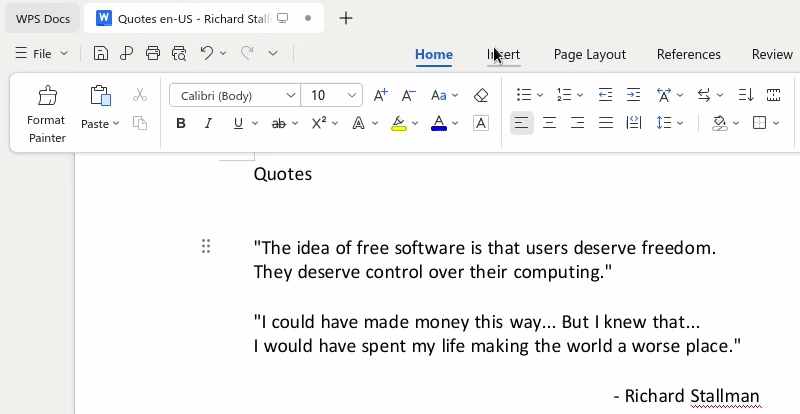

açılan pencerede `"İngilizce (Amerika Birleşik Devletleri)"` varsayılan olarak kullanılabilir sözlükler arasında olacaktır.

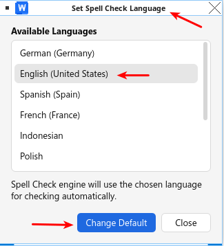


isterseniz `"Change Default"` düğmesine tıklayabilirsiniz; ancak `en_US` MUI zaten kurulu olduğu için varsayılan olarak zaten seçiliydi.

Şimdi pencerenin sol alt köşesindeki durum çubuğuna bakın; buna benzer bir gösterge görünür:

`Spell Check: Disabled ⌵`

Bu göstergeye tıklayın, `"Enabled"` olarak değişir.

Ayrıca `"⌵"` simgesine tıklarsanız bu ve diğer seçenekler açılır menüde görünür.

Etkinleştirildikten sonra WPS Office belgenin yazımını otomatik olarak denetlemeye başlar. Bu noktadan itibaren yanlış yazılmış kelimeler altı çizili görünür; altı çizili bir kelimeye sağ tıklamak düzeltme önerilerini gösterir. Kullanıcı bu seçeneği tekrar devre dışı bırakana kadar yazım denetimi etkin kalır:


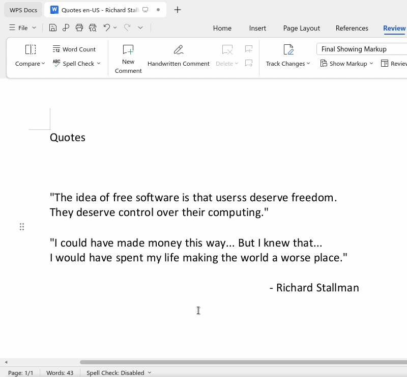

---

## İspanyolca yazım denetimini çalıştırma

İspanyolca yazım denetiminin çalışması için MX Linux 23 oturumundan çıkın (başka bir dildeyseniz) ve Login Manager’da örneğin şunu seçin:

```
İspanyolca - Ekvador
```

Ardından şunu düzenleyin:

```bash
gedit ~/.config/Kingsoft/Office.conf
```

ve İspanya İspanyolcası için bu içeriği bırakın:

```
[General]
languages=es_ES

[6.0]
common\DefaultLanguage=3082
common\Local\UILanguage=3082
wpsoffice\Application%20Settings\AppComponentMode=prome_independ
wpsoffice\Application%20Settings\AppComponentModeInstall=prome_independ
```

Bu yapılandırmada şu MUI kurulu olmalıdır:

```
/opt/kingsoft/wps-office/office6/mui/es_ES
```

ve sözlük:

```
/opt/kingsoft/wps-office/office6/dicts/spellcheck/es_ES/
```


### İspanyolca yazım denetimini etkinleştirme

WPS Writer’ı açın. Şu adlı şerit sekmesine gidin:

`"Revisar"`

ve orada

`"Revisión ortográfica ⌵"`

`"⌵"` simgesine tıklayın ve alt menüye tıklayın:

`"Establecer idioma"`

ve açılan pencerede `"Español (España)"` varsayılan olarak kullanılabilir sözlükler arasında olacaktır.

ve `"Establecer predeterminado"` düğmesine tıklayın; ancak `es_ES` MUI zaten kurulu olduğu için varsayılan olarak zaten seçiliydi.

Şimdi pencerenin sol alt köşesindeki durum çubuğuna bakın; buna benzer bir gösterge görünür:

`Revisión ortográfica: Desactivado ⌵`

Bu göstergeye tıklayın, `"Activado"` olarak değişir.


Ayrıca `"⌵"` simgesine tıklarsanız bu ve diğer seçenekler açılır menüde görünür.

Yazım denetimi etkinleştirildiğinde WPS Office belgenin yazımını otomatik olarak denetlemeye başlar. Bu noktadan itibaren yanlış yazılmış kelimeler altı çizili görünür; altı çizili bir kelimeye sağ tıklamak düzeltme önerilerini gösterir. Kullanıcı bu seçeneği tekrar devre dışı bırakana kadar yazım denetimi etkin kalır:

Şimdilik WPS Office 12’nin bu Çin sürümünde İspanyolca yazım denetimi yalnızca bu depodaki `es_ES` sözlüğüyle çalışır:

/build/wps-office-12-dicts-active/es_ES/

Ancak `wps-libreoffice-dicts` klasöründeki aşağıdaki sözlükler WPS Office 11’de çalıştıkları gibi çalışmaz:

```
/wps-libreoffice-dicts/es_AR
/wps-libreoffice-dicts/es_BO
/wps-libreoffice-dicts/es_CL
/wps-libreoffice-dicts/es_CO
/wps-libreoffice-dicts/es_CR
/wps-libreoffice-dicts/es_CU
/wps-libreoffice-dicts/es_DO
/wps-libreoffice-dicts/es_EC
/wps-libreoffice-dicts/es_ES
/wps-libreoffice-dicts/es_GQ
/wps-libreoffice-dicts/es_GT
/wps-libreoffice-dicts/es_HN
/wps-libreoffice-dicts/es_MX
/wps-libreoffice-dicts/es_NI
/wps-libreoffice-dicts/es_PA
/wps-libreoffice-dicts/es_PE
/wps-libreoffice-dicts/es_PH
/wps-libreoffice-dicts/es_PR
/wps-libreoffice-dicts/es_PY
/wps-libreoffice-dicts/es_SV
/wps-libreoffice-dicts/es_US
/wps-libreoffice-dicts/es_UY
/wps-libreoffice-dicts/es_VE
```

### Henüz test edilecek İspanyolca bölgesel ayarlar

Bu Login Manager bölgesel ayarlarının İspanyolca yazım denetimiyle hâlâ test edilmesi gerekiyor:

```
İspanyolca - Arjantin
İspanyolca - Bolivya
İspanyolca - Kolombiya
İspanyolca - Nikaragua
İspanyolca - Panama
```

Çalışan diğerleri yukarıdaki tabloda listelenmiştir.

## Çalışmayan Meksika İspanyolcası sözlüğünün testi

Aşağıdaki testi yaptım çünkü hem `es_MX` MUI hem de `es_MX` yazım denetimi sözlüğü mevcut.

Testte Login Manager’dan şu seçenekle oturum açıldı:

```
Meksika İspanyolcası - Meksika
```

ve WPS şu şekilde yapılandırıldı:

```
[General]
languages=es_MX

[6.0]
common\DefaultLanguage=2058
common\Local\UILanguage=2058
wpsoffice\Application%20Settings\AppComponentMode=prome_independ
wpsoffice\Application%20Settings\AppComponentModeInstall=prome_independ
```

MUI ile:

```
/opt/kingsoft/wps-office/office6/mui/es_MX
```

ve sözlük şurada:

```
/opt/kingsoft/wps-office/office6/dicts/spellcheck/es_MX/
```

WPS dil penceresinde `"Español (México)"` gösterir, ancak yazım denetimi çalışmaz. Buna karşın aynı pencerede `"Español (España)"` sözlüğü seçilirse çalışır.

## Almanca yazım denetimini çalıştırma

Almanca için oturumu kapatın ve Login Manager’da şunu seçin:

```
Almanca - Almanya
```

Ardından `Office.conf` dosyasını şöyle yapılandırın:

```
[General]
languages=de_DE

[6.0]
common\DefaultLanguage=1031
common\Local\UILanguage=1031
wpsoffice\Application%20Settings\AppComponentMode=prome_independ
wpsoffice\Application%20Settings\AppComponentModeInstall=prome_independ
```

Etkinleştirme İngilizce sözlüğe benzer:

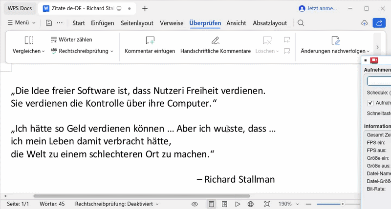

Bu testte şu çalıştı:

```
/opt/kingsoft/wps-office/office6/mui/de_DE
/opt/kingsoft/wps-office/office6/dicts/spellcheck/de_DE/
```

## Fransızca yazım denetimini çalıştırma

Fransızca için oturumu kapatın ve Login Manager’da şunu seçin:

```
Fransızca - Fransa
```

Etkinleştirme İngilizce sözlüğe benzer.


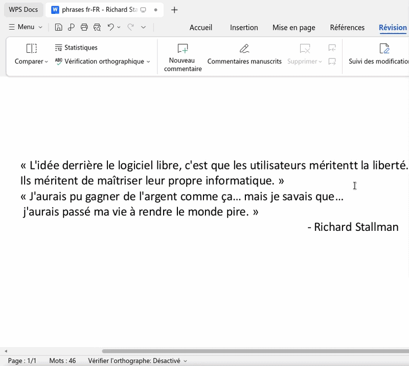

Ardından `Office.conf` dosyasını şöyle yapılandırın:

```
[General]
languages=fr_FR

[6.0]
common\DefaultLanguage=1036
common\Local\UILanguage=1036
wpsoffice\Application%20Settings\AppComponentMode=prome_independ
wpsoffice\Application%20Settings\AppComponentModeInstall=prome_independ
```

Bu testte şununla çalıştı:

```
/opt/kingsoft/wps-office/office6/mui/fr_FR
/opt/kingsoft/wps-office/office6/dicts/spellcheck/fr_FR/
```


## Endonezce yazım denetimini çalıştırma

Endonezce için, Login Manager’da henüz görünmüyorsa önce locale oluşturun:

```bash
sudo dpkg-reconfigure locales
```

Listede şunu işaretleyin:

```
id_ID.UTF-8 UTF-8
```

Ardından oturumu kapatın ve Login Manager’da şunu seçin:

```
Endonezce - Indonesia
```

Ardından `Office.conf` dosyasını şöyle yapılandırın:

```
[General]
languages=id_ID

[6.0]
common\DefaultLanguage=1057
common\Local\UILanguage=1057
wpsoffice\Application%20Settings\AppComponentMode=prome_independ
wpsoffice\Application%20Settings\AppComponentModeInstall=prome_independ
```

Etkinleştirme İngilizce sözlüğe benzer. Yazım denetimi dili penceresinde `"Endonezce"` görünmelidir.

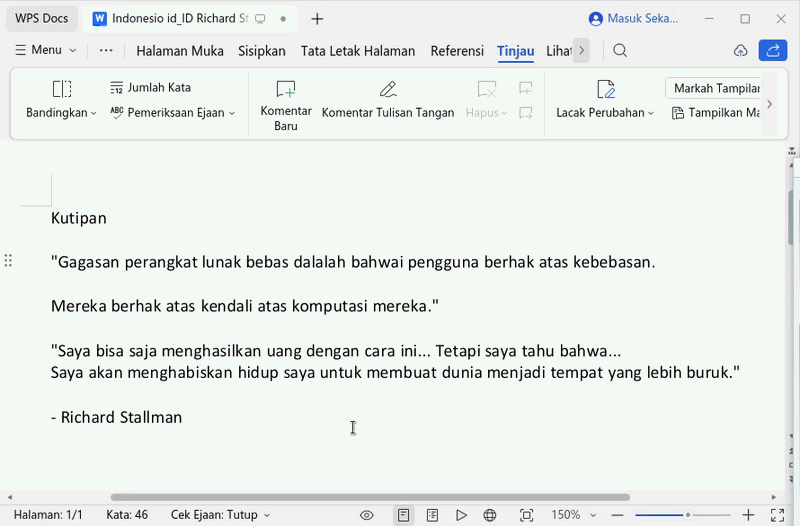

Bu testte şununla çalıştı:

```
/opt/kingsoft/wps-office/office6/mui/id_ID
/opt/kingsoft/wps-office/office6/dicts/spellcheck/id_ID/
```

Not: Linux oturumu `id_ID.UTF-8` kullansa da kurulu `id_ID` sözlüğü `main.aff` içinde `SET ISO8859-1` kullanır ve WPS Office 12’de doğru çalıştı.

## Lehçe yazım denetimini çalıştırma

Lehçe için oturumu kapatın ve Login Manager’da şunu seçin:

```
Lehçe - Polonya
```

Ardından `Office.conf` dosyasını şöyle yapılandırın:

```
[General]
languages=pl_PL

[6.0]
common\DefaultLanguage=1045
common\Local\UILanguage=1045
wpsoffice\Application%20Settings\AppComponentMode=prome_independ
wpsoffice\Application%20Settings\AppComponentModeInstall=prome_independ
```

Etkinleştirme İngilizce sözlüğe benzer. Yazım denetimi dili penceresinde `"Polski"` görünmelidir.

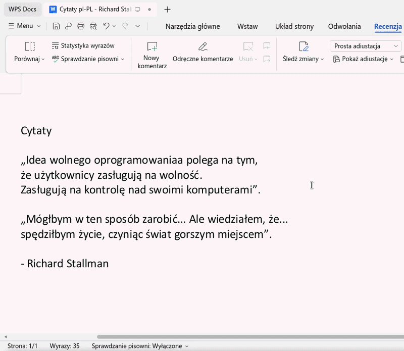


Bu testte şununla çalıştı:

```
/opt/kingsoft/wps-office/office6/mui/pl_PL
/opt/kingsoft/wps-office/office6/dicts/spellcheck/pl_PL/
```

Not: Bu testte eski WPS Office 11.2.0.9255 sözlüklerinden alınan UTF-8 `pl_PL` sözlüğü çalıştı. LibreOffice’ten dönüştürülen sözlük `ISO8859-2` idi ve WPS Office 12’de iyi çalışmadı.

## Brezilya Portekizcesi yazım denetimini çalıştırma

Brezilya Portekizcesi için oturumu kapatın ve Login Manager’da şunu seçin:

```
Brezilya Portekizcesi - Brezilya
```

Ardından `Office.conf` dosyasını şöyle yapılandırın:

```
[General]
languages=pt_BR

[6.0]
common\DefaultLanguage=1046
common\Local\UILanguage=1046
wpsoffice\Application%20Settings\AppComponentMode=prome_independ
wpsoffice\Application%20Settings\AppComponentModeInstall=prome_independ
```

Etkinleştirme İngilizce sözlüğe benzer. Yazım denetimi dili penceresinde `"Português do Brasil"` görünmelidir.

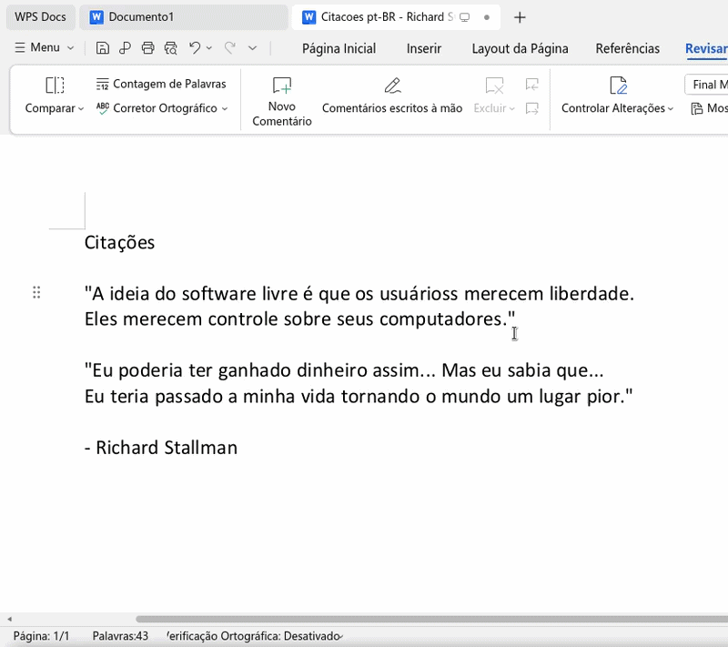

Bu testte şununla çalıştı:

```
/opt/kingsoft/wps-office/office6/mui/pt_BR
/opt/kingsoft/wps-office/office6/dicts/spellcheck/pt_BR/
```

Not: `pt_BR` MUI `lang.conf` içinde `FallBack=pt_PT` içerse de, yazım denetimi dili penceresinde `"Português do Brasil"` seçildiğinde WPS doğru şekilde denetim yaptı. Aynı oturumda `"Português (Portugal)"` seçilirse yazım denetimi çalışmaz.

## Çalışmayan Portekiz Portekizcesi sözlüğünün testi

Aşağıdaki testi yaptım çünkü hem `pt_PT` MUI hem de `pt_PT` yazım denetimi sözlüğü mevcut.

Testte Login Manager’dan şu seçenekle oturum açıldı:

```
Avrupa Portekizcesi - Portekiz
```

ve WPS şu şekilde yapılandırıldı:

```
[General]
languages=pt_PT

[6.0]
common\DefaultLanguage=2070
common\Local\UILanguage=2070
wpsoffice\Application%20Settings\AppComponentMode=prome_independ
wpsoffice\Application%20Settings\AppComponentModeInstall=prome_independ
```

MUI ile:

```
/opt/kingsoft/wps-office/office6/mui/pt_PT
```

ve sözlük şurada:

```
/opt/kingsoft/wps-office/office6/dicts/spellcheck/pt_PT/
```

Sözlük adı düzeltilmeden önce WPS `"Portuguê"` gösteriyordu, şimdi `"Português (Portugal)"` göstermelidir; her iki durumda da `pt_PT` sözlüğüyle yazım denetimi çalışmadı.

Aynı `pt_PT.UTF-8` locale ve `pt_PT` MUI yapılandırmasında, Brezilya Portekizcesi sözlüğü kullanılarak yazım denetimi çalıştı:

```
/opt/kingsoft/wps-office/office6/dicts/spellcheck/pt_BR/
```

## Rusça yazım denetimini çalıştırma

Rusça için oturumu kapatın ve Login Manager’da şunu seçin:

```
Rusça - Rusya
```

Ardından `Office.conf` dosyasını şöyle yapılandırın:

```
[General]
languages=ru_RU

[6.0]
common\DefaultLanguage=1049
common\Local\UILanguage=1049
wpsoffice\Application%20Settings\AppComponentMode=prome_independ
wpsoffice\Application%20Settings\AppComponentModeInstall=prome_independ
```

Etkinleştirme İngilizce sözlüğe benzer. Yazım denetimi dili penceresinde `"Русский (Россия)"` görünmelidir.

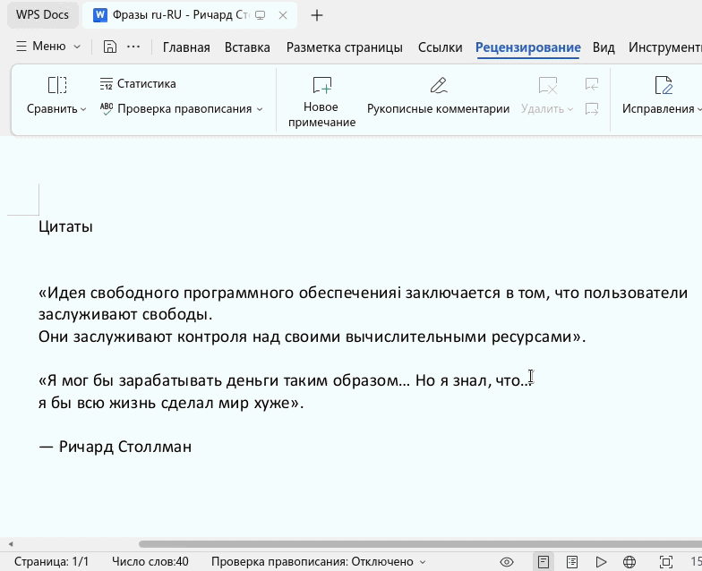


Bu testte şununla çalıştı:

```
/opt/kingsoft/wps-office/office6/mui/ru_RU
/opt/kingsoft/wps-office/office6/dicts/spellcheck/ru_RU/
```

Not: Rusça yazım denetimi sıfırdan oluşturulmuş yeni bir belgede doğru çalıştı. Başlangıçta İngilizce oluşturulmuş bir belgede, çevrilmiş Rusça metin yapıştırıldıktan sonra bile WPS mevcut metne yazım denetimini doğru uygulamadı.

## Türkçe yazım denetimini çalıştırma

Türkçe için oturumu kapatın ve Login Manager’da şunu seçin:

```
Türkçe - Türkiye
```

Ardından `Office.conf` dosyasını şöyle yapılandırın:

```
[General]
languages=tr_TR

[6.0]
common\DefaultLanguage=1055
common\Local\UILanguage=1055
wpsoffice\Application%20Settings\AppComponentMode=prome_independ
wpsoffice\Application%20Settings\AppComponentModeInstall=prome_independ
```

Etkinleştirme İngilizce sözlüğe benzer. Yazım denetimi dili penceresinde `"Türkçe (Türkiye)"` görünmelidir.

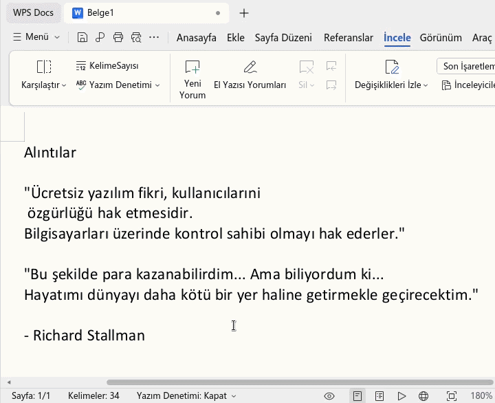

Bu testte şununla çalıştı:

```
/opt/kingsoft/wps-office/office6/mui/tr_TR
/opt/kingsoft/wps-office/office6/dicts/spellcheck/tr_TR/
```

## Başvuru: WPS tarafından Windows’ta indirilen MUI paketleri

MUI dosyalarının grafik arayüz için nereden geldiğini merak ediyorsanız, bunları Microsoft Windows 10 üzerinde elde ettim. WPS Office dil paketlerini kullanıcı yollarına indirir; bu bilgi arayüz dili dosyalarını araştırmak için başvuru olarak kullanışlıdır.

Önce Windows için WPS Office 12’yi indirip kurun:

[https://wps.com/office/windows/](https://wps.com/office/windows/)

Windows 10 örneği:


Ardından dilleri indirin:


İndirilen diller şurada görünebilir:

```
C:\Users\youruser\AppData\Roaming\kingsoft\wps_intl\addons\pool\win-x64
```


Dil listesi şurada görünebilir:

```
C:\Users\youruser\AppData\Local\Kingsoft\WPS Office\12.1.0.25830\office6\mui\lang_list\lang_list.json
```


İspanyolca Windows sürümünün dahil ettiği bazı paketler şurada görünebilir:

```
C:\Users\youruser\AppData\Local\Kingsoft\WPS Office\12.1.0.25830\office6\mui
```


Bu proje size yardımcı olduysa depoya yıldız bırakabilirsiniz.

---

# Teşekkürler

Bana yazıp WPS Office 12’de İspanyolca yazım denetimi sözlüğünü çalıştırmanın bir yolunu bulduğunu söyleyen kullanıcı [mmvill](https://github.com/mmvill)’e teşekkürler.
