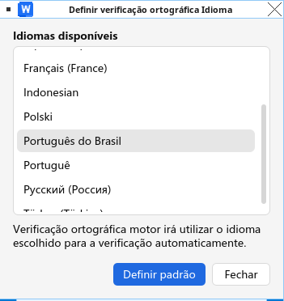

# Guia rápido: corretor ortográfico em português do Brasil no WPS Office 12 para Linux

Este guia curto instala a interface e o corretor ortográfico em português do Brasil para WPS Office 12 no Linux.

## Requisitos

- WPS Office 12.x instalado.
- Este repositório baixado ou clonado.
- Permissões de administrador com `sudo`.
- WPS Office aberto pelo menos uma vez para que `~/.config/Kingsoft/Office.conf` exista.

## Instalar WPS Office

Baixe WPS Office 12 para Linux pelo site chinês oficial:

[https://www.wps.cn/product/wpslinux](https://www.wps.cn/product/wpslinux)

Você pode instalar o pacote `.deb` com seu instalador de pacotes:


ou pelo terminal:

```bash
sudo dpkg -i wps-office*.deb
```

## Instalar MUI e dicionários

A partir da raiz deste repositório, execute:

```bash
sudo cp -r build/wps-mui/* /opt/kingsoft/wps-office/office6/mui/
sudo cp -r build/dicts-active/* /opt/kingsoft/wps-office/office6/dicts/spellcheck/
```

Para português do Brasil, o WPS Office 12 usará:

```text
/opt/kingsoft/wps-office/office6/mui/pt_BR
/opt/kingsoft/wps-office/office6/dicts/spellcheck/pt_BR/
```

## Configurar WPS Office

Edite:

```bash
gedit ~/.config/Kingsoft/Office.conf
```

Use este conteúdo:

```ini
[General]
languages=pt_BR

[6.0]
common\DefaultLanguage=1046
common\Local\UILanguage=1046
wpsoffice\Application%20Settings\AppComponentMode=prome_independ
wpsoffice\Application%20Settings\AppComponentModeInstall=prome_independ
```

Feche completamente o WPS Office e abra novamente.

## Ativar a correção ortográfica

No WPS Writer, selecione `Português do Brasil` como idioma da correção ortográfica e defina como padrão se necessário.




